# CloudPan

**Go + Vue 自托管私有云存储 —— 带完整 Web 桌面外壳（Windows 12 / macOS / Deepin 三主题）的网盘系统**

A self-hosted private cloud drive in **Go + Vue** with a full **web desktop shell** — Windows 12, macOS and Deepin themes.

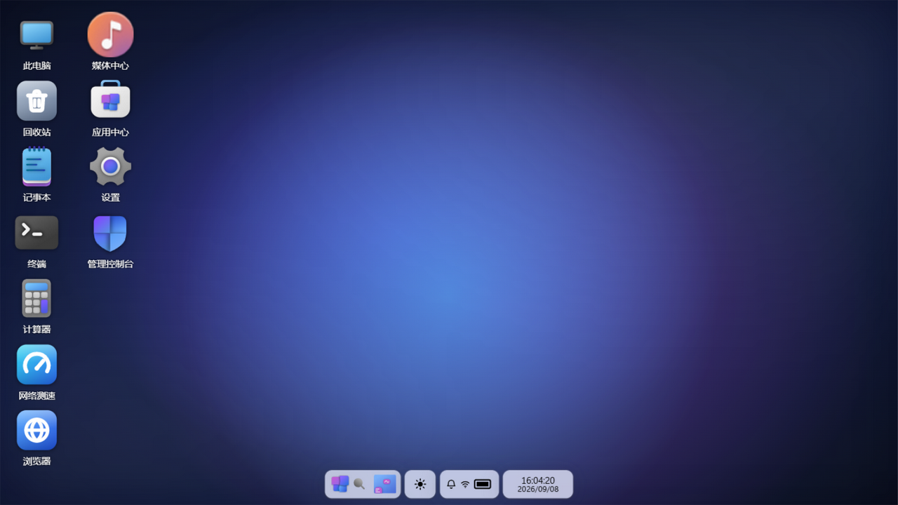

---

## 项目简介

CloudPan 是一个用 **Go（Gin + GORM + SQLite）** 与 **Vue 3 + TypeScript + Vite** 从零实现的私有云存储系统。前端构建产物通过 `go:embed` 嵌入 Go 二进制，**单文件部署**，无 Docker 依赖。

它的最大特色是**完整的 Web 桌面外壳**：打开浏览器就像开了一台电脑——BIOS 风格开机动画、系统登录页、可拖拽/缩放/贴边的窗口、开始菜单 / Launchpad / 启动器、任务栏 / Dock、全局搜索、控制中心……并且内置 **三套可切换的操作系统主题**：

| Windows 12 概念版风格 | macOS（对标 Sonoma） | Deepin（对标 DDE 25） |
|---|---|---|
|  | 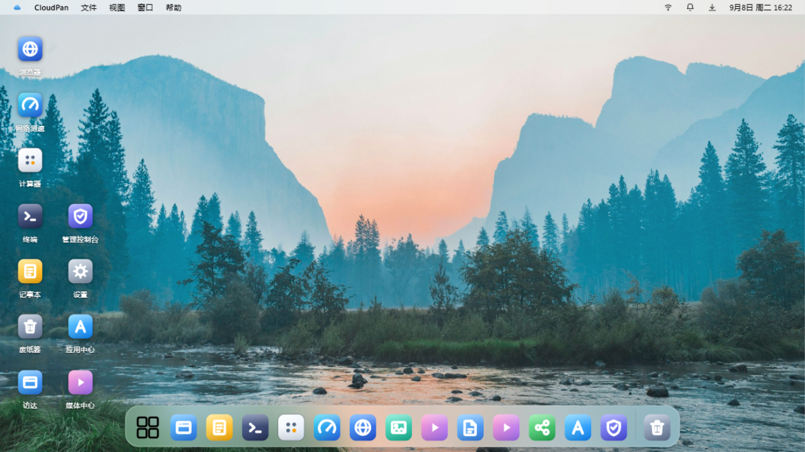 | 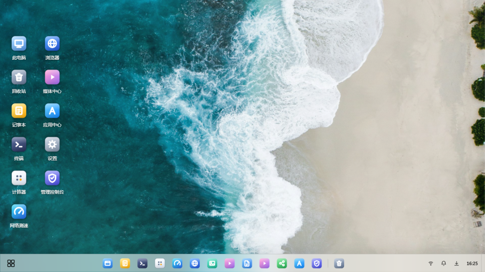 |

桌面内置 16 个应用：文件资源管理器、此电脑、回收站、记事本、终端、计算器、网络测速、**内置浏览器**、图片查看器、媒体播放器、Office 编辑器、媒体中心、来自他人的共享、应用中心、设置、管理控制台。

网盘核心功能对齐主流网盘：分块上传 + 断点续传 + SHA-256 秒传、分享链接（提取码/有效期/次数）、回收站、压缩解压、离线下载（服务器代下 + SSRF 防护）、WebDAV、ONLYOFFICE 在线编辑、多用户/用户组/配额/审计日志。存储层采用**驱动注册表架构**（借鉴 Cloudreve 设计），本地目录与 123 云盘 / 阿里云盘 / 百度网盘 / 天翼云盘（实验性）即插即用。

## Project Overview

CloudPan is a private cloud storage system built from scratch with **Go (Gin + GORM + SQLite)** and **Vue 3 + TypeScript + Vite**. The frontend is embedded into the Go binary via `go:embed` — **single-file deployment**, no Docker required.

Its standout feature is a **complete web desktop shell**: opening the browser feels like booting a computer — BIOS-style boot animation, system login, draggable/resizable/snappable windows, Start menu / Launchpad / full-screen launcher, taskbar / Dock, global search, control center — with **three switchable OS themes**:

| Windows 12 (concept style) | macOS (Sonoma-style) | Deepin (DDE 25-style) |
|---|---|---|
|  |  |  |

The desktop ships 16 built-in apps: File Explorer, This PC, Recycle Bin, Notepad, Terminal, Calculator, Network Speed Test, a **built-in browser** (server-side proxied), Image Viewer, Media Player, Office Editor, Media Center, Shared with Me, App Center, Settings, and an Admin Console.

The storage core matches mainstream cloud drives: chunked upload with resume + SHA-256 instant upload, share links (access code / expiry / download count), recycle bin, zip compression/extraction, offline download (server-side fetch with SSRF protection), WebDAV, ONLYOFFICE online editing, multi-user / user groups / quotas / audit log. The storage layer uses a **driver registry architecture** (inspired by Cloudreve): local directories plus 123Pan / Aliyun Drive / Baidu Wangpan / Tianyi Cloud (experimental) plug in and out.

---

## 截图 Screenshots

### Windows 12 主题

| 登录 | 桌面 | 开始菜单 |
|---|---|---|
| 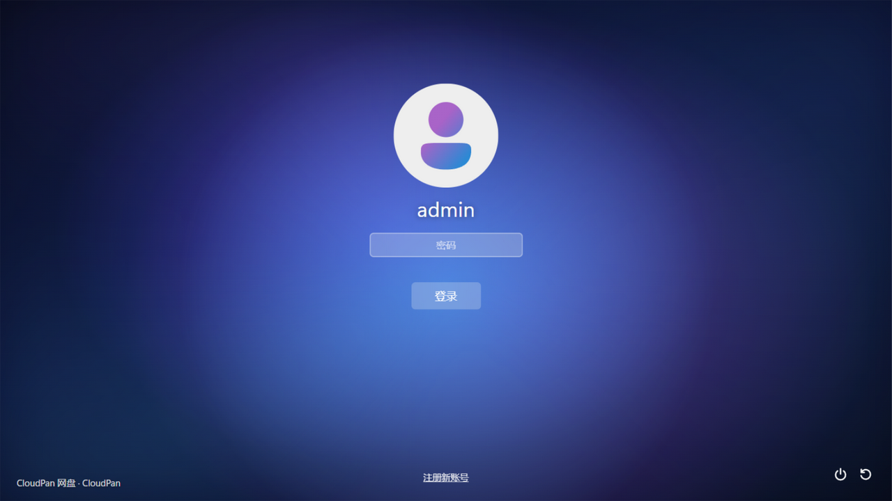 |  |  |

| 全局搜索（分类筛选） | 小组件 | 控制中心 |
|---|---|---|
| 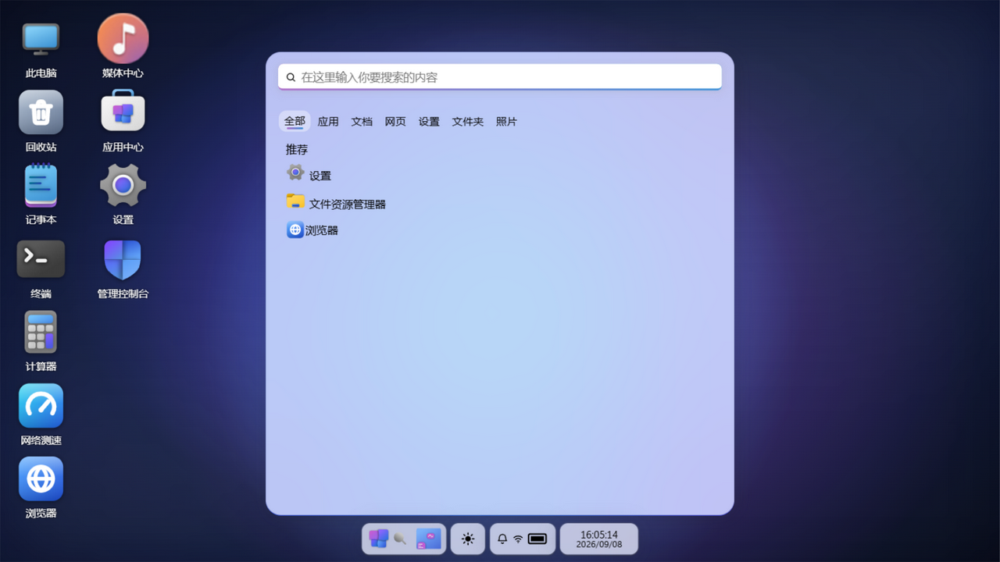 | 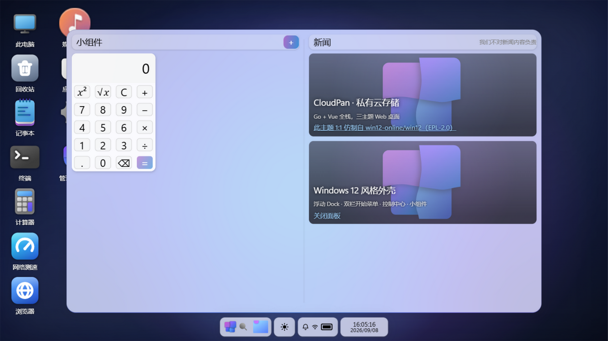 | 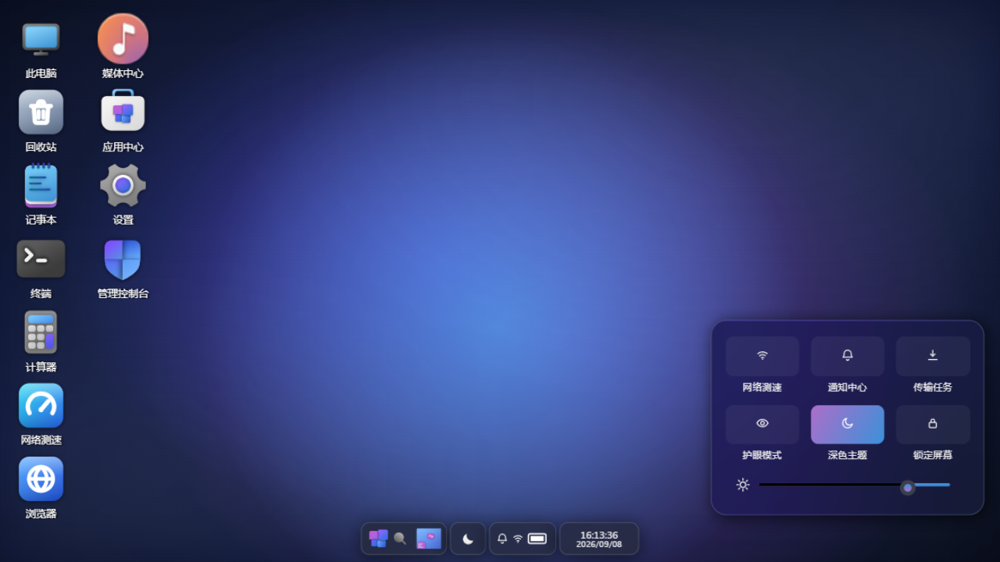 |

| 此电脑 | 文件资源管理器（C:\图片） | 内置浏览器（经服务端代理访问百度） |
|---|---|---|
|  | 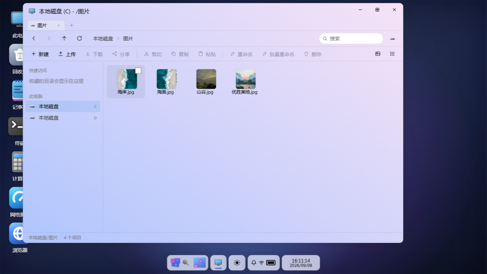 |  |

| 设置（三主题 + 壁纸 + 深色模式） | 深色登录 | 深色桌面 |
|---|---|---|
|  |  |  |

### macOS 主题

| 登录 | 桌面（菜单栏 + 放大 Dock） | Launchpad |
|---|---|---|
|  |  | 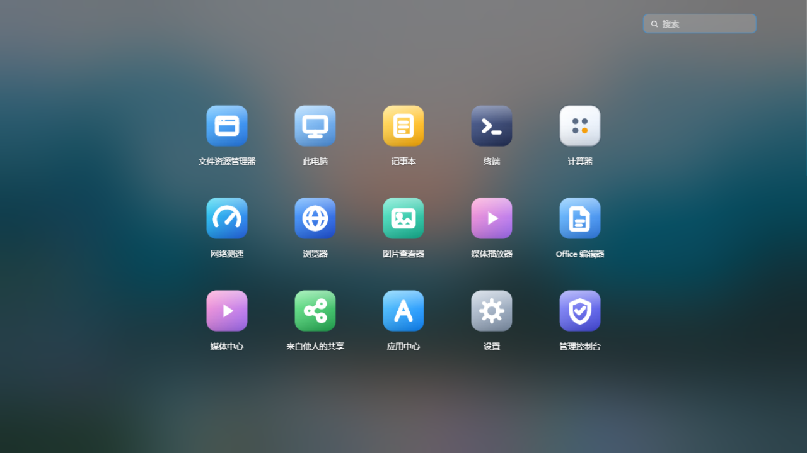 |

| 文件管理器窗口（红绿灯） | 深色桌面 | 深色内置浏览器 |
|---|---|---|
| 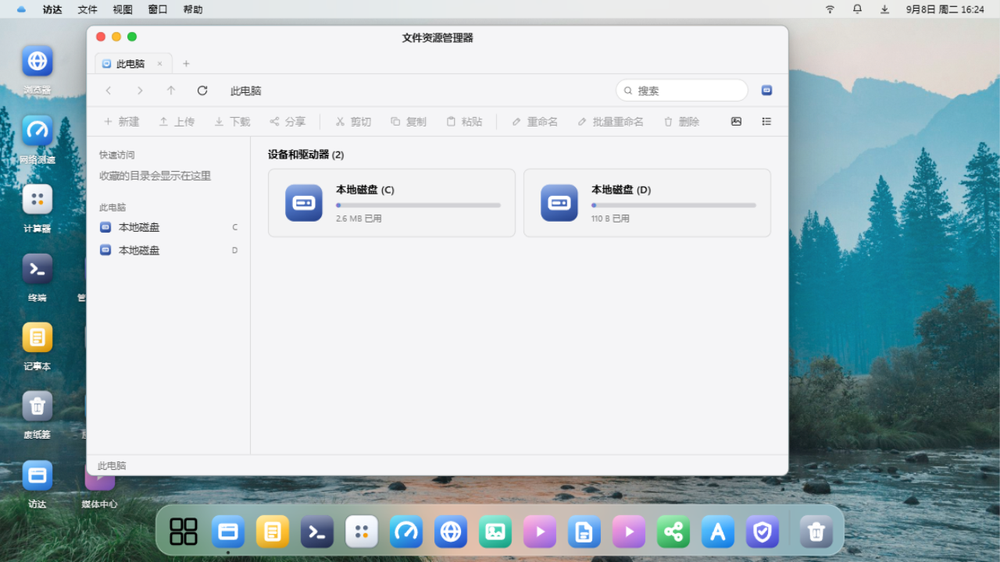 | 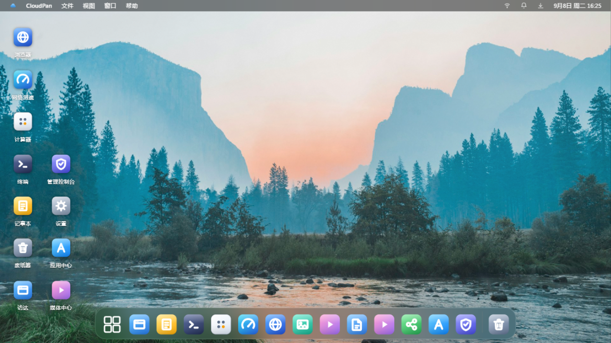 |  |

### Deepin 主题

| 登录 | 桌面（DDE 25 全宽任务栏） | 全屏启动器 |
|---|---|---|
|  |  |  |

| 此电脑窗口 | 深色登录 | 深色启动器 |
|---|---|---|
|  | 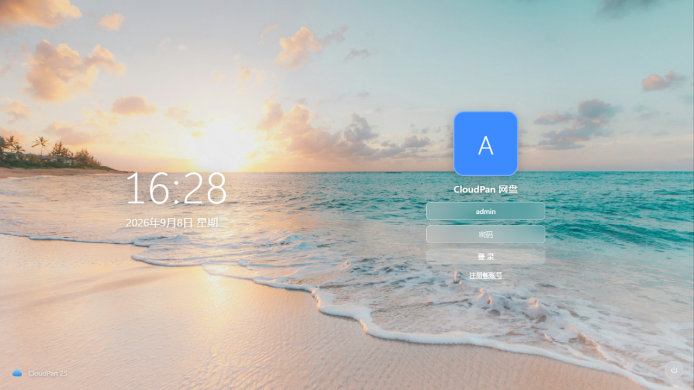 |  |

| 深色桌面 |
|---|
| 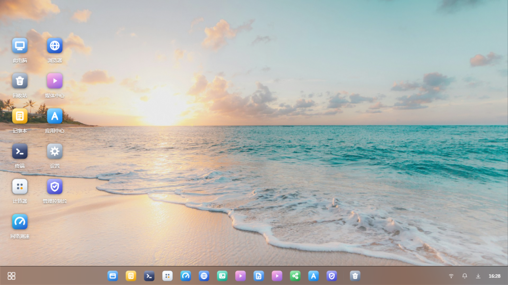 |

---

## 功能特性

**桌面外壳（三主题共享架构，`themes/` 插件包）**
- 开机动画 → 登录 → 桌面全流程；注册/锁屏；管理员与普通用户
- 窗口管理器：拖拽、8 向缩放、最大化、贴边分屏、最小化飞行动画、多标签资源管理器
- Windows 12：BIOS 开机 + 花朵加载、**悬浮多段胶囊 Dock**（开始/搜索/小组件/日-夜主题切换/控制中心/日期胶囊）、双栏开始菜单（应用列表 + 已固定 + 推荐收藏 + 电源区）、全局搜索面板（全部/应用/文档/网页/设置/文件夹/照片 分类，网页结果直达内置浏览器、设置分类深链到对应页）、控制中心（网速/通知/传输/护眼/深色/锁定 + 亮度）、时间小组件
- macOS：顶部菜单栏（应用菜单 + 系统托盘）、**高斯放大 Dock**（启动弹跳）、Launchpad（搜索 + 分类）、红绿灯窗口、无卡片式登录（大时钟 + 头像 + 胶囊输入）
- Deepin（DDE 25）：底部 48px 全宽任务栏（左启动器 / 中应用 / 右托盘 + 显示桌面）、**全屏启动器**（分类导航 + 搜索 + 电源区）、40px 居中标题栏、登录双栏
- 每主题 9 张壁纸（4 张 Unsplash 免费授权照片 + 5 套 CSS 渐变）+ 深色模式，设置里一键切换
- 全局右键菜单、通知中心（未读角标 + 软清除）、传输浮窗（多任务并发、暂停/继续/取消）

**网盘核心**
- 存储策略抽象（借鉴 Cloudreve 设计）：本地目录 + 123 云盘 + 阿里云盘 + 百度网盘（默认只读）+ 天翼云盘（实验性），驱动注册表架构，新后端即插即用；管理控制台挂载 + 测通 + OAuth 授权
- 文件管理：新建/重命名/移动/复制/删除（入回收站）/搜索（本盘/全局）/属性/收藏快速访问；网格与列表双视图；完整右键菜单
- 上传：**分块上传 + 断点续传 + SHA-256 秒传**（哈希索引去重）
- 下载：单文件直下、多选/目录 zip 打包流式下载；图片/视频/音频 Range 流式预览
- 分享：提取码/有效期/剩余下载次数/预览开关/浏览下载计数，公开分享页
- 回收站：还原 / 彻底删除 / 清空，删除自动计入用户用量
- 压缩解压：右键压缩为 zip / 解压到当前目录（含子目录安全校验）
- 离线下载：HTTP(S) 链接服务器代下载入网盘，DB 任务队列重启自动恢复，**SSRF 三层防护**
- WebDAV：`/dav/{用户名}/{盘符}/`，独立应用密码，可挂载进 Windows 资源管理器/手机
- ONLYOFFICE 在线编辑（未配置时自动回退内置编辑器：xlsx 可编辑表格 / docx 预览 / PDF 预览）

**终端（真实 shell）**
- 本地终端：服务端 PTY（Linux pty / Windows ConPTY，`creack/pty`）启动真实 shell，xterm.js + WebSocket 二进制透传，完整 TUI（vim/htop 均可用）；shell 白名单（Linux: bash/sh/zsh/fish，Windows: cmd/PowerShell），工具栏可切换
- 远程 SSH 终端：保存多个连接（密码 / 私钥，凭证 AES-256-GCM 加密落库，API 永不回显），`x/crypto/ssh` 拨号 + PTY 协商；主机密钥 **TOFU**（首次信任、变更即拒绝）；目标地址安全校验（拒绝 169.254/16 云元数据、0.0.0.0/8、组播/保留段，域名解析后逐 IP 复检）；测通接口返回延迟与远端系统信息
- **SFTP 文件管理面板**（SSH 模式）：面包屑浏览、上传（选择/拖拽，逐文件进度条）、下载（中文文件名 RFC5987）、新建/重命名/删除（目录递归）、连接池复用 + 空闲清扫
- 并发限制：每用户 4 本地 / 8 SSH 会话，全局 32；连接/文件操作全量审计日志；受「终端」系统功能门控（应用中心可停）

**内置浏览器（特色功能）**
- 桌面内置浏览器应用：多标签（每页独立沙箱 iframe）、地址栏（裸域名自动补 https、非 URL 当百度搜索词）、前进/后退/刷新/主页、快捷入口、"在系统浏览器中打开"兜底
- **服务端代理**绕过站点 X-Frame-Options/CSP frame-ancestors 的嵌入限制：HTML 自动重写 src/href/action/poster/srcset/meta-refresh 为代理路径、剥离站点 `<base>` 与 CSP、注入代理 base 兜底、gbk/big5/utf-16/latin1 转 UTF-8；非 HTML 资源透传（128MB 上限、300s 缓存）
- 安全设计：短时效 HMAC 代理票据（`pt`，30 分钟，非真实 JWT）；iframe 沙箱**故意不带 allow-same-origin**（站点 JS 读不到网盘登录态）；复用离线下载的 SSRF 三层防线（URL 校验 + 重定向复检 + 拨号层 DNS 复检）；每 IP 300 次/分钟限速；访问日志凭证脱敏

**多用户体系**
- 角色（admin/user）+ 用户组（配额、功能白名单：分享/WebDAV/压缩/离线/浏览器/应用中心、分享可下载、限速、可用存储策略白名单）
- **用户数据隔离**：本地存储策略按用户划分独立目录（`<策略根目录>/<用户目录名>/`，如 `C:/admin`、`C:/johngko`），每个用户在网页/WebDAV/分享/离线下载/版本恢复看到的都是自己目录下的虚拟根，互相不可见；目录名取安全 ASCII 用户名（其余取 `user_<id>`）并首次固化到 `UserSetting(local_dir)`，改用户名不影响已有数据。云盘策略不隔离（后端账号本身即边界）
- 站点设置：站点名、注册开关、邀请码、公告；审计日志（登录/文件操作/分享/管理动作/通知）
- 登录：Win12 登录页用户名框常显（预填 admin，注册用户可清空输入自己的账号）；开放注册后新用户即可登录并使用自己的隔离空间

**内置应用（16）**
文件资源管理器 / 此电脑 / 回收站 / 记事本（读写网盘文本）/ **终端**（本地真实 shell + 远程 SSH 终端，xterm.js 完整 TUI；SSH 模式带 SFTP 文件管理面板：浏览/上传/下载/新建/重命名/删除，支持拖拽上传）/ 计算器 / **网络测速**（界面仿 LibreSpeed，随机数据端点不可压缩防虚高）/ **内置浏览器** / 图片查看器（缩放旋转 + EXIF/GPS）/ 媒体播放器（视频 + 音频 + 歌词字幕，封面取自 ID3）/ Office 编辑器 / 媒体中心（可安装应用）/ 来自他人的共享 / 应用中心 / 设置（壁纸主题/账号/WebDAV 密码/我的分享/离线下载）/ 管理控制台（仪表盘/用户/用户组/存储策略与云盘授权/站点设置/审计日志）

---

## 快速开始

```bat
:: Windows（需已安装 Go 1.22+ 与 Node.js 18+）
build.bat      :: 构建前端并嵌入，产出 server\cloudpan.exe
start.bat      :: 启动，浏览器访问 http://localhost:18322
```

```bash
# Linux / macOS
./build.sh && ./server/cloudpan
```

- 默认管理员：`admin / admin123`（**登录后请立即在 设置 → 账号 修改密码**）
- 数据目录：`server/data/`（SQLite 数据库、回收站、缩略图、上传临时区、密钥），可用环境变量 `CP_DATA` 重定向
- 端口：默认 `18322`，`CP_PORT` 修改；对外可达地址用 `CP_PUBLIC_URL` 配置（ONLYOFFICE 集成需要）
- 首次使用：管理员登录 → 管理控制台 → 存储策略 → 挂载一个本地目录为磁盘（如把某目录挂载为 C 盘），桌面"此电脑"即出现该盘

**开发模式**

```bash
cd web && npm install && npm run dev   # Vite 5173，/api 代理到 18322
cd server && go run .                  # 后端
```

## Quick Start

```bat
:: Windows (requires Go 1.22+ and Node.js 18+ installed)
build.bat      :: builds the frontend, embeds it, produces server\cloudpan.exe
start.bat      :: starts the server, open http://localhost:18322
```

```bash
# Linux / macOS
./build.sh && ./server/cloudpan
```

- Default admin: `admin / admin123` (**change it immediately in Settings → Account after first login**)
- Data directory: `server/data/` (SQLite DB, recycle bin, thumbnails, upload temp, secret key); override with `CP_DATA`
- Port: default `18322`, override with `CP_PORT`; public URL (needed by ONLYOFFICE) via `CP_PUBLIC_URL`
- First run: log in as admin → Admin Console → Storage Policies → mount a local directory as a disk (e.g. C:), which then shows up under This PC on the desktop

**Development mode**

```bash
cd web && npm install && npm run dev   # Vite on 5173, /api proxied to 18322
cd server && go run .                  # backend
```

---

## 目录结构

```
cloudpan/
├── build.bat / build.sh / start.bat   # 构建 & 启动脚本
├── docs/screenshots/                  # README 截图
├── server/                            # Go 后端（单二进制，embed 前端）
│   ├── main.go
│   └── internal/
│       ├── config/  model/  dto/      # 配置 / 全量表结构 / 统一响应
│       ├── fscore/                    # 存储驱动接口+注册表、路径安全、分块上传、秒传、zip、SSRF
│       ├── driver/                    # 123 / 阿里 / 百度 / 天翼 云盘驱动
│       ├── handler/                   # auth/fs/upload/share/recycle/admin/office/webdav/browser/tasks
│       └── web/                       # go:embed 前端产物
└── web/                               # Vue 3 + TS + Vite 前端
    └── src/
        ├── shell/                     # ShellHost 路由壳 / 分享页
        ├── themes/                    # 三套 OS 主题包（windows / macos / deepin，插件式）
        ├── apps/                      # 16 个内置应用
        ├── stores/                    # session / windows / apps / ui / transfer (Pinia)
        └── api/                       # axios 封装与各模块 API
```

## Repository Layout

```
cloudpan/
├── build.bat / build.sh / start.bat   # build & launch scripts
├── docs/screenshots/                  # README screenshots
├── server/                            # Go backend (single binary, embedded frontend)
│   ├── main.go
│   └── internal/
│       ├── config/  model/  dto/      # config / table models / unified responses
│       ├── fscore/                    # storage driver interface+registry, path safety, chunked upload, dedup, zip, SSRF guard
│       ├── driver/                    # 123Pan / Aliyun / Baidu / Tianyi cloud drivers
│       ├── handler/                   # auth/fs/upload/share/recycle/admin/office/webdav/browser/tasks
│       └── web/                       # go:embed frontend build output
└── web/                               # Vue 3 + TS + Vite frontend
    └── src/
        ├── shell/                     # ShellHost router shell / share page
        ├── themes/                    # three OS theme packages (windows / macos / deepin, pluggable)
        ├── apps/                      # 16 built-in applications
        ├── stores/                    # session / windows / apps / ui / transfer (Pinia)
        └── api/                       # axios wrapper and per-module APIs
```

---

## 部署加固

**HTTPS（推荐 Caddy 自动签证书）**

```
pan.你的域名.com {
    reverse_proxy 127.0.0.1:18322
}
```

Nginx 参考：`location / { proxy_pass http://127.0.0.1:18322; proxy_set_header Host $host; client_max_body_size 0; }`（`client_max_body_size 0` 解除上传大小限制）。启用 HTTPS 后把 `CP_PUBLIC_URL` 设为 https 地址（ONLYOFFICE 集成要求两侧同协议）。

**开机自启**
- Windows 服务（NSSM）：`nssm install CloudPan E:\cloudpan\server\cloudpan.exe` + `AppEnvironmentExtra CP_PORT=18322 CP_DATA=E:\cloudpan\server\data`
- Linux systemd：`[Service] WorkingDirectory=/opt/cloudpan/server; ExecStart=/opt/cloudpan/server/cloudpan; Restart=always`

**安全说明**
- 登录防爆破：同 IP+用户名 15 分钟内失败 5 次锁定（Web 登录与 WebDAV 共用同一锁定表）；登录接口 IP 限速（10 次/分钟）
- **客户端 IP 信任边界**：默认**不信任任何** `X-Forwarded-For`（直接取 TCP 对端地址），攻击者无法伪造 XFF 头绕过上述按 IP 的限速/锁定。部署在反向代理（Caddy/Nginx）之后时，用环境变量 `CP_TRUSTED_PROXIES` 显式声明代理网段（逗号分隔 CIDR/IP，如 `127.0.0.1` 或 `10.0.0.0/8`），系统才会从 XFF 链中还原真实客户端 IP
- **终端默认仅管理员可用**：应用清单中终端默认关闭，且默认用户组权限禁用终端（存量部署启动时自动补上，尊重已显式配置）；普通用户即便拿到会话也无法调用任何 `/terminal/*` 端点。如需放行，在应用中心开启并给用户组/个人授权。终端以服务器进程用户身份执行命令（如以 root 启动即 root 权限），请仅部署在受信任环境，或用独立低权限账号运行
- 修改/重置密码后该用户**全部旧 JWT 立即失效**（令牌版本号校验）；禁用账号与密码错误返回一致提示（防用户名枚举）
- 在线 Office 回调拉取**钉扎到配置的 Document Server 同源地址**（scheme + host 白名单），防止回调被利用发起 SSRF
- 磁力链显式 tracker（tr=）与 HTTP 直链/种子同过 SSRF 校验（内网/保留段拒绝）；BT/磁力需独立功能权限
- 分享提取码验证按 IP 限速（防爆破密码分享）；只读用户组的 WebDAV 一律拒绝写操作
- **html/htm/xhtml/svg 一律强制下载**（`attachment`），不以内联方式直接响应，杜绝存储型 XSS 在站内域执行；xlsx 预览 HTML 经 DOM 白名单净化
- CSP 收紧：移除 `unsafe-eval` 与 `script/style/connect/frame` 的 `https:` 通配，仅按配置精确放行 ONLYOFFICE Document Server 来源
- **首次部署管理员密码随机生成**，仅在启动日志打印一次（不落任何文件），登录请立即修改
- SSH 连接凭证 AES-256-GCM 加密存储（密钥 = 服务器 secret.key）；主机密钥 TOFU 防中间人；目标地址拒绝云元数据/保留段
- 直链/预览支持 `?t=令牌` 查询参数（img/video/a 标签无法携带请求头），令牌即登录 JWT，生产环境建议全程 HTTPS
- 访问日志自动脱敏（`t`/`token`/`st`/`pt` 参数）
- 离线下载与内置浏览器代理均过 SSRF 三层防护（URL 校验 + 重定向复检 + 拨号层 DNS 复检），环回/链路本地/ftp 一律拒绝
- 资源硬上限：离线下载 / BT 种子 / 归档解压 / 上传分片均有总量与条目数上限（防 zip-bomb 与磁盘拖爆）
- 上传分片临时区每 6 小时自动清扫（结束/超时 48h 的会话）
- 建议定期备份 `server/data/cloudpan.db`

## Deployment & Hardening

**HTTPS (Caddy recommended, auto-issued certs)**

```
pan.your-domain.com {
    reverse_proxy 127.0.0.1:18322
}
```

Nginx: `location / { proxy_pass http://127.0.0.1:18322; proxy_set_header Host $host; client_max_body_size 0; }` (`client_max_body_size 0` lifts the upload size limit). Once on HTTPS, set `CP_PUBLIC_URL` to the https URL (required for ONLYOFFICE; both sides must share the same scheme).

**Auto-start**
- Windows service (NSSM): `nssm install CloudPan E:\cloudpan\server\cloudpan.exe` + `AppEnvironmentExtra CP_PORT=18322 CP_DATA=E:\cloudpan\server\data`
- Linux systemd: `[Service] WorkingDirectory=/opt/cloudpan/server; ExecStart=/opt/cloudpan/server/cloudpan; Restart=always`

**Security notes**
- Login brute-force protection: 5 failures within 15 minutes for the same IP+username locks the account (Web login and WebDAV share the same lockout table); login endpoint rate-limited per IP (10/min)
- **Client-IP trust boundary**: **no `X-Forwarded-For` is trusted by default** (the TCP peer address is used), so attackers cannot spoof XFF to bypass the per-IP rate limits/lockouts. When deployed behind a reverse proxy (Caddy/Nginx), declare the proxy CIDRs via the `CP_TRUSTED_PROXIES` env var (comma-separated CIDR/IP, e.g. `127.0.0.1` or `10.0.0.0/8`) and the real client IP will be restored from the XFF chain
- **Terminal is admin-only by default**: the terminal app is disabled in the app manifest and blocked for the default user group (existing deployments get the flag backfilled on boot; explicit configs are respected); regular users cannot call any `/terminal/*` endpoint even with a valid session. To grant access, enable the app in the App Center and authorize the group/user. Note the terminal executes commands as the server process user (root if started as root) — run in trusted environments only, or under a dedicated low-privilege account
- Changing/resetting a password **invalidates all of that user's JWTs immediately** (token version check); disabling an account and wrong password return the same message (username-enumeration safe)
- ONLYOFFICE save-callback fetches are **pinned to the configured Document Server origin** (scheme + host allowlist) to prevent callback-driven SSRF
- Magnet trackers (tr=) and plain-HTTP seeds pass the same SSRF validation (intranet/reserved ranges rejected); BT/magnet requires its own feature permission
- Share extraction-code verification is rate-limited per IP (no brute-forcing password-protected shares); read-only groups are refused all WebDAV mutating methods
- **html/htm/xhtml/svg are always served as `attachment`** (never inline), closing stored XSS execution on the site origin; xlsx preview HTML is DOM-sanitized against a tag/attribute allowlist
- CSP tightened: `unsafe-eval` and all `https:` wildcards on script/style/connect/frame removed; only the configured ONLYOFFICE Document Server origin is allowed (resolved dynamically, 10s cache)
- **First-deploy admin password is random**, printed once to the startup log only (never persisted) — change it at first login
- SSH connection credentials stored AES-256-GCM encrypted (key = server secret.key); host-key TOFU; target addresses reject cloud metadata/reserved ranges
- Direct links/previews accept `?t=<jwt>` query params (img/video/a tags cannot carry headers); the token IS the login JWT — serve over HTTPS in production
- Access log auto-redacts credentials (`t`/`token`/`st`/`pt` params)
- Offline download and the built-in browser proxy both pass the 3-layer SSRF guard (URL validation + redirect re-check + dialer-level DNS re-check); loopback/link-local/ftp always rejected
- Hard resource caps on offline download / BT torrents / archive extraction / chunked upload (total bytes + entry counts, anti zip-bomb and disk exhaustion)
- Chunked-upload temp area auto-swept every 6 hours (sessions finished/expired >48h)
- Back up `server/data/cloudpan.db` regularly

---

## 云盘接入与扫码绑定教程

支持的云盘：**123云盘**（官方开放平台）、**阿里云盘**（开放平台 OAuth）、**百度网盘**（官方 API，OAuth）、**天翼云盘**（Cookie，实验性）。
阿里云盘 / 百度网盘支持**手机扫二维码一键绑定**（参考 AList 的挂载体验）：管理台把厂商授权页渲染成二维码，手机扫码→登录确认→厂商重定向回系统回调接口→token 自动落库，全程无需复制粘贴。

### 通用前置：配置「公开地址」

扫码绑定依赖厂商把手机浏览器重定向回本系统（`<公开地址>/api/cloud/callback`），因此**手机必须能访问该地址**：

1. 管理控制台 → 站点设置 → **公开地址**，填写手机可访问的地址（如 `https://pan.example.com` 或内网 `http://192.168.1.10:18322`）
2. 纯内网部署：手机与服务器处于同一局域网，填内网 IP 即可
3. 公网部署：域名需能解析到服务器（含反向代理）
4. 手机完全不可达本站时，可改用对话框内的「粘贴授权码」回退模式（oob 授权页直接显示授权码，人工粘贴）

### 阿里云盘（扫码绑定）

1. 打开 <https://open.alipan.com>（阿里云盘开放平台），注册开发者账号
2. 「应用管理」→ 创建应用，获得 **ClientID / ClientSecret**
3. CloudPan 管理控制台 → 存储策略 → **挂载存储** → 类型选「阿里云盘」→ 填入 ClientID/ClientSecret
4. 点「**扫码授权**」→ 对话框出现二维码 → 用**阿里云盘 App**（或手机浏览器）扫描二维码
5. 手机上登录阿里云盘账号并确认授权 → 手机页面显示「绑定成功」
6. 管理台对话框 3 秒内自动检测到绑定、token 自动填入 → 点「挂载」保存 → 列表「测通」验证
7. 此后 access_token 自动续期（refresh_token 轮换后自动落库），长期有效

### 百度网盘（扫码绑定）

1. 打开 <https://console.bce.baidu.com>（百度智能云控制台）→ 「百度应用开放体系」创建应用，获得 **AppKey / SecretKey**
2. **在应用配置里登记回调地址**：`<本站公开地址>/api/cloud/callback`（百度要求回调地址预先登记，必须与站点设置一致）
3. CloudPan 管理控制台 → 存储策略 → 挂载存储 → 类型选「百度网盘」→ 填入 AppKey/SecretKey
4. 点「**扫码授权**」→ 手机扫二维码 → 登录百度账号并确认授权 → 自动回填
5. 保存 → 「测通」验证
6. 说明：**上传/写操作**（新建/上传/移动/删除）需向百度申请接口白名单，未获批前为**只读挂载**（浏览/预览/下载/秒传不受限）；token 自动滚动续期（30 天有效期自动刷新）

### 123云盘 / 天翼云盘

- **123云盘**：<https://www.123pan.com/developer> 注册开发者 → 创建应用 → 填入 ClientID/ClientSecret → 挂载 → 测通（无需 OAuth 跳转）
- **天翼云盘**（实验性，社区逆向 Cookie，随时可能失效）：电脑浏览器登录天翼云盘网页版 → F12 复制 Cookie 整串填入

## Cloud Storage Backends & QR-Scan Binding

Supported: **123Pan** (official open platform), **Aliyun Drive** (open-platform OAuth), **Baidu Wangpan** (official API, OAuth), **Tianyi Cloud** (cookie, experimental).
Aliyun Drive / Baidu Wangpan support **one-click binding by scanning a QR code with your phone** (AList-style mounting experience): the admin console renders the vendor's OAuth authorization page as a QR code — scan with your phone → log in and confirm → the vendor redirects back to the system's callback endpoint → tokens are stored automatically, with zero copy-paste.

### Prerequisite: configure the "Public URL"

QR binding relies on the vendor redirecting the phone's browser back to `<public-url>/api/cloud/callback`, so **the phone must be able to reach that address**:

1. Admin Console → Site Settings → **Public URL** — set an address reachable from your phone (e.g. `https://pan.example.com`, or the LAN IP `http://192.168.1.10:18322` for LAN deployments)
2. LAN-only deployment: put the phone on the same network and use the LAN IP
3. Public deployment: the domain must resolve to the server (reverse proxy included)
4. If your phone cannot reach the site at all, use the dialog's "paste the authorization code" fallback (the oob authorization page displays the code directly)

### Aliyun Drive (QR binding)

1. Go to <https://open.alipan.com>, register a developer account
2. Create an app under App Management — note the **ClientID / ClientSecret**
3. CloudPan Admin Console → Storage Policies → **Mount** → type "Aliyun Drive" → fill in ClientID/ClientSecret
4. Click **Scan & Authorize** → a QR code appears → scan it with the **Aliyun Drive app** (or a phone browser)
5. Log in and confirm on the phone → the phone shows "binding succeeded"
6. The dialog detects the binding within ~3s and fills in the token automatically → click Mount to save → verify with "test connection"
7. access_token auto-renews from then on (rotated refresh tokens are persisted), so the mount stays valid long-term

### Baidu Wangpan (QR binding)

1. Go to <https://console.bce.baidu.com> → create an app under the Baidu open platform — note the **AppKey / SecretKey**
2. **Register the callback URL in the app settings**: `<your-public-url>/api/cloud/callback` (Baidu requires callbacks to be pre-registered; it must match the site setting)
3. Admin Console → Storage Policies → Mount → type "Baidu Wangpan" → fill in AppKey/SecretKey
4. Click **Scan & Authorize** → scan with your phone → log in to Baidu and confirm → tokens fill in automatically
5. Save → verify with "test connection"
6. Note: **write operations** (mkdir / upload / move / delete) require a Baidu API allow-list approval; until granted the mount is **read-only** (browsing / preview / download / instant-upload dedup are unaffected). Tokens auto-renew (30-day access tokens are refreshed automatically).

### 123Pan / Tianyi Cloud

- **123Pan**: <https://www.123pan.com/developer> → register → create an app → fill in ClientID/ClientSecret → Mount → test (no OAuth redirect needed)
- **Tianyi Cloud** (experimental, community-reverse-engineered cookie, may break at any time): log in to the Tianyi web drive in a desktop browser → copy the full Cookie string via F12 → paste it in

---

## 在线 Office（ONLYOFFICE）部署指南

配置 Document Server 后，所有 Office 文档（doc/docx/odt/rtf、xls/xlsx/ods、ppt/pptx/odp、csv）打开即进入 **ONLYOFFICE 真实编辑器**——与 Cloudreve 在线 Office 相同的模式：预览与编辑是同一套编辑器界面，权限决定只读/可写，保存自动归档旧版本。PDF 走内置查看器（与 Cloudreve 一致）。**未配置 Document Server 时自动回退内置静态渲染**（docx/xlsx/pptx 客户端渲染，编辑器窗口内有配置提示条）。

**1. 部署 Document Server（Docker 推荐，官方镜像 `onlyoffice/documentserver`，约 2GB 内存）**

```bash
# JWT 密钥：生成一个随机串，DS 与 CloudPan 两侧必须一致（9.4.0+ 镜像 JWT 默认开启，环境变量名是 JWT_SECRET）
SECRET=$(openssl rand -hex 32)

docker run -d --name cloudpan-ds --restart unless-stopped --network host \
  -e JWT_SECRET="$SECRET" \
  onlyoffice/documentserver
```

- `--network host`：DS 直接监听宿主机 80 端口，且能回拉 `127.0.0.1:18322` 的文件。若用端口映射（`-p 11111:80`），DS 必须能按「公开地址」访问到 CloudPan（容器内 127.0.0.1 指向容器自身，需改用宿主机 IP 或 `--add-host=host.docker.internal:host-gateway`）。
- 首次启动需 1–3 分钟初始化（PostgreSQL/RabbitMQ/文档服务），`/healthcheck` 返回 `true` 即就绪。

**2. CloudPan 侧配置（管理控制台 → 站点设置）**

| 设置项 | 值 | 说明 |
|---|---|---|
| Document Server 地址 | `http://127.0.0.1` | **浏览器**访问 DS 的地址；外网/其他机器访问时改为服务器对外地址 |
| ONLYOFFICE JWT | 上面生成的 `$SECRET` | 必须与 DS 的 `JWT_SECRET` 一致，文档配置与回调因此带签名 |
| 公开地址 | 留空或 `http(s)://<服务器地址>:18322` | **DS 回拉文件/回调**用的 CloudPan 地址（DS 必须可达）；留空按访客浏览器地址自动推导 |

点「连接测试」应显示"连接正常"。CSP 会自动钉扎 DS 来源（10 秒缓存），无需其他改动。

**3. 行为说明**

- 编辑：可写身份（管理员/可写组/ rw 共享）打开即编辑态；只读身份（只读组/ ro 共享/游客）强制只读视图，保存回调对只读令牌一律拒写。
- 保存：DS 自动/强制保存 → 回调 CloudPan → 旧版本自动归档进版本历史 → 覆盖文件（rename-in 原子写）。
- 安全：回调拉取钉扎 DS 同源地址（防 SSRF）；文件拉取/回调走 HMAC 签名 token（24h 有效）。

## Online Office (ONLYOFFICE) Deployment Guide

With a Document Server configured, every Office document (doc/docx/odt/rtf, xls/xlsx/ods, ppt/pptx/odp, csv) opens straight into the **real ONLYOFFICE editor** — the same mode as Cloudreve's online Office: preview and editing share one editor UI, permissions decide read-only vs editable, and saves auto-archive the previous version. PDF uses the built-in viewer (as in Cloudreve). **Without a Document Server, it falls back to built-in static rendering** (client-side docx/xlsx/pptx, with a configuration hint bar in the editor window).

**1. Deploy the Document Server (Docker recommended, official image `onlyoffice/documentserver`, ~2GB RAM)**

```bash
# JWT secret: one random string, must match on both DS and CloudPan (9.4.0+ images enable JWT by default; the env var is JWT_SECRET)
SECRET=$(openssl rand -hex 32)

docker run -d --name cloudpan-ds --restart unless-stopped --network host \
  -e JWT_SECRET="$SECRET" \
  onlyoffice/documentserver
```

- `--network host`: the DS listens on the host's port 80 and can fetch files from `127.0.0.1:18322`. With port mapping (`-p 11111:80`) instead, the DS must reach CloudPan via the "Public URL" (127.0.0.1 inside a container points to the container itself — use the host IP or `--add-host=host.docker.internal:host-gateway`).
- First boot takes 1–3 minutes to initialize (PostgreSQL/RabbitMQ/document services); `/healthcheck` returning `true` means ready.

**2. Configure CloudPan (Admin Console → Site Settings)**

| Setting | Value | Notes |
|---|---|---|
| Document Server URL | `http://127.0.0.1` | The address the **browser** uses to reach the DS; for remote/LAN access use the server's public address |
| ONLYOFFICE JWT | the `$SECRET` above | Must match the DS's `JWT_SECRET`; the document config and callbacks are then signed |
| Public URL | empty or `http(s)://<server>:18322` | The CloudPan address the **DS uses to fetch files / deliver callbacks** (must be DS-reachable); empty = auto-derived from the visitor's browser host |

"Test connection" should report OK. The CSP pins the DS origin automatically (10s cache) — no other changes needed.

**3. Behavior**

- Editing: writable identities (admin / writable group / rw share) open in edit mode; read-only identities (read-only group / ro share / guest) are forced into read-only view, and save callbacks are rejected for read-only tokens.
- Saving: DS auto/forced save → callback to CloudPan → previous version auto-archived into history → file overwritten (rename-in atomic write).
- Security: callback fetches are pinned to the DS origin (anti-SSRF); file fetch/callback use HMAC-signed tokens (24h).

---

## 更新日志 Changelog

> 每次更新推送时在此追加条目（中文 + 英文），最新在上；**只保留最近 2 天**的日期段，推送时删除更早的段。
> Every release appends entries here (Chinese + English), newest first; **only the last 2 days** of date sections are kept — older sections are pruned on each push.

### 2026-09-12

- **文件操作对齐 Windows 逻辑（修复 4 处反馈问题）**：① **新建不再误报「重命名失败，目标文件已存在」**——右键/工具栏「新建」（文件夹、文本文档、思维导图、白板、流程图）创建后直接点「确定」不再弹错误：名称未改动时前端直接确认、不发重命名请求；后端 `Rename` 对「重命名为原名」按无操作处理（此前存在性检查把文件自身当成"已存在的目标"，改名到真实存在的其他名仍正常报错）。② **新建重名自动加序号**（Windows 同款格式）：`新建文件夹 (2)`、`新建文本文档 (2).txt`。③ **剪切/复制/粘贴对齐 Windows**：剪切后粘贴（含空白处「粘贴」、文件夹右键「粘贴到内部」、内部拖拽）遇到目标同名**文件**时弹「是否替换文件？」询问框——选「替换」先将被替换的旧文件归档进版本历史（可恢复）再移动，同名**目录**则跳过该项并提示；把剪切的文件粘贴/拖回它所在的文件夹 = 无操作、无提示（Windows 行为，不再误判为冲突）；复制保持原有行为（后端自动加序号，不询问）；把目录移动/粘贴进自身或自身子目录被前后端双重拒绝并明确提示。④ **修复文件拖不到文件夹**：根因是网格卡片/列表行缺 `draggable` 属性（dragstart 处理器存在但从不触发），且 drop 处理器中内部拖拽分支排在外部文件分支之后、被 `dataTransfer.items` 非空判断静默吞掉——现已先判内部拖拽类型再判外部文件，并支持**多选整组拖拽**（拖动选中项中任意一个，整组一起移动）；拖到空白处 = 移动到当前目录（多选同样生效）。验证：E2E 21/21（rename 同名 no-op、改名到已存在名仍拒绝、move 冲突拒绝/overwrite 替换+旧版本归档+归档版本内容校验、同名目录 overwrite 仍拒绝、移入自身/自身子孙拒绝、原地移动 no-op、复制自动加序号）+ GUI 14/14（新建→确定无错误+自动序号 (2)、拖文件卡片到文件夹卡片移动成功+提示、剪切→粘贴到内部→替换询问框→内容被替换、粘贴回所在目录无操作）
  - **Windows-style file-ops fixes (four reported issues)**: ① "New" items (folder / text doc / mind map / whiteboard / flowchart) no longer show "rename failed, target already exists" when OK is clicked right after creation without renaming — the frontend confirms in place without sending a rename request when the name is unchanged, and the backend `Rename` now treats rename-to-own-name as a no-op (previously the existence check saw the file itself as the "existing target"; renaming onto a genuinely different existing name still errors). ② New items with a taken name are auto-numbered in Windows format: `New Folder (2)`, `New Text Document (2).txt`. ③ Cut/copy/paste now matches Windows: cut+paste (blank-area "Paste", folder right-click "Paste into", internal drag) prompts "Replace file?" when the destination contains a same-named **file** — choosing Replace archives the old file to version history first (restorable) then moves; a same-named **directory** is skipped with a notice; pasting/dragging a cut file back into the folder it already lives in is a silent no-op (Windows behavior, no false conflict); copy keeps its existing behavior (backend auto-numbers, no prompt); moving a directory into itself or one of its descendants is rejected on both frontend and backend with a clear message. ④ Fixed files not being draggable onto folders: the root cause was a missing `draggable` attribute on grid cards / list rows (the dragstart handler existed but never fired), plus the internal-drag branch of the drop handler sat behind the external-file branch and was silently swallowed by the non-empty `dataTransfer.items` check — internal drags are now detected before the external-file branch, and **multi-select dragging moves the whole selection** (dragging any selected item drags all of them); dropping on blank space moves into the current directory (multi-select included). Verified: E2E 21/21 (rename-to-same-name no-op, rename-to-existing still rejected, move conflict rejection / overwrite-replace with old-version archiving + archived-content check, same-name-dir rejected even with overwrite, move-into-self/descendant rejected, in-place move no-op, copy auto-numbering) + GUI 14/14 (new-item OK without error + auto-numbering (2), dragging a file card onto a folder card moves it with a success toast, cut → paste-into → replace prompt → content replaced, paste-back-to-own-folder no-op)

- **新增 5 个独立应用：思维导图 / 白板 / 流程图 / 图片编辑器 / PDF 阅读器**（均为管理员「系统功能」：应用中心开关 + 管理控制台按用户组/个人分配，默认启用；全局停用 = 对所有人（含管理员）硬关闭；资源管理器双击/「打开方式」/「新建」入口全部按功能门控）：① **思维导图**（`.smm`，[simple-mind-map](https://github.com/kalcaddle/mind-map) MIT 完整 dist 离线内置于 `/vendor/mindmap/`，同源 iframe + takeOverApp 宿主桥）：打开 = 文件 JSON 注入、保存（工具栏按钮 + Ctrl+S）= 写回原路径；非 JSON 文件（如 `.xmind` zip 包）可打开查看但提示格式并禁用保存，防止误覆盖丢数据；「新建」菜单与空白处右键可新建思维导图（内置最小模板）。② **白板**（`.excalidraw`，[Excalidraw](https://github.com/excalidraw/excalidraw) v0.18 React 组件懒加载 chunk，不进主包）：打开 = 解析 .excalidraw JSON 为 initialData，保存 = 序列化 elements/appState/files 落盘。③ **流程图**（`.drawio`，[drawio](https://github.com/jgraph/drawio) v31.4.5 官方 .war webapp 离线内置于 `/vendor/drawio/`）：同源 iframe `?embed=1&proto=json` 走官方 embed postMessage 协议——载入（load 消息带 exportProtocol 开启导出协议）/ 宿主主动导出保存（export 请求-响应）/ 应用内「文件>保存」事件回传；新建流程图 = 最小 mxfile 模板。④ **图片编辑器**（PNG/JPG 等，自研 canvas 工具条）：向左/向右旋转 90°、水平/垂直翻转、亮度/对比度/饱和度滑杆、重置；保存 = 保持原格式（非 png/webp/gif 转 jpeg q0.92）分块上传覆盖原文件。⑤ **PDF 阅读器**（[pdfjs](https://github.com/mozilla/pdf.js) v6.3.289 完整 viewer，repo 源码树离线内置于 `/vendor/pdfjs/`，含 113 语言 l10n）：同源 iframe 直读文件令牌链接，自带目录/搜索/缩放/打印。⑥ **工程与基建**：全部静态资源走 `web/public/vendor/` → vite 原样拷入 dist → `go:embed` 自动嵌入（Go 路由零改动）；配套修复两处静态服务——vendor 被 iframe 嵌入的页面（mindmap host / pdfjs viewer / drawio）CSP `frame-ancestors` 放宽为 `'self'` + `X-Frame-Options: SAMEORIGIN`（其余页面维持 `'none'`/`DENY` 防点击劫持不变），目录根路径（如 `/vendor/drawio/`）改为提供目录内 index.html（此前落 SPA 兜底导致 drawio 白屏）；drawio 裁剪后保留 math4（公式）与 templates（模板对话框）运行期必需资源，移除无引用、仅 Electron 用的 22.5MB `integrate.min.js`。单二进制体积 ~76MB → **~177MB**（增量全部为离线内置资源 drawio 106M / pdfjs 17M / mindmap 11M；如需瘦身可删 `vendor/drawio` 回退 CDN 加载）。验证：E2E 33/33（5 key 启停/allowed 链路含全局硬关闭与组权限、.smm/.excalidraw/.drawio 写入-读取往返、vendor 资源 200）+ GUI 8/8（思维导图 iframe 节点渲染 + Ctrl+S、白板 Excalidraw canvas、流程图 drawio embed 载入图形、图片编辑器旋转 16×8→8×16、PDF 阅读器 canvas 渲染、zip 浏览器回归、右键新建三项入口）
  - **Five new standalone apps: Mind Map / Whiteboard / Flowchart / Image Editor / PDF Reader** (all admin "system features": App Center switch + per-group/per-user assignment in the admin console, enabled by default; globally disabled = hard cutoff for everyone including admins; Explorer double-click / "Open with" / "New" entries are all feature-gated): ① **Mind Map** (`.smm`, [simple-mind-map](https://github.com/kalcaddle/mind-map) MIT full dist vendored offline at `/vendor/mindmap/`, same-origin iframe + takeOverApp host bridge): open = inject the file's JSON, save (toolbar + Ctrl+S) = write back to the original path; non-JSON files (e.g. `.xmind` zips) can be opened for viewing but show a format notice and disable saving, so they can't be clobbered into JSON and lose data; "New" menu + blank-area right-click create mind maps from a built-in minimal template. ② **Whiteboard** (`.excalidraw`, [Excalidraw](https://github.com/excalidraw/excalidraw) v0.18 React component as a lazy-loaded chunk, kept out of the main bundle): open = parse the .excalidraw JSON into initialData; save = serialize elements/appState/files back to disk. ③ **Flowchart** (`.drawio`, [drawio](https://github.com/jgraph/drawio) v31.4.5 official .war webapp vendored offline at `/vendor/drawio/`): same-origin iframe `?embed=1&proto=json` using the official embed postMessage protocol — load (with exportProtocol enabled in the load message) / host-initiated export-save (export request-response) / the in-app File>Save event pushing content back; new flowcharts use a minimal mxfile template. ④ **Image Editor** (PNG/JPG etc., self-built canvas toolbar): rotate 90° left/right, horizontal/vertical flip, brightness/contrast/saturation sliders, reset; save keeps the original format (non-png/webp/gif re-encoded as JPEG q0.92) and overwrites the file via chunked upload. ⑤ **PDF Reader** ([pdfjs](https://github.com/mozilla/pdf.js) v6.3.289 full viewer, repo source tree vendored offline at `/vendor/pdfjs/` incl. 113-language l10n): same-origin iframe reading the file token link directly, with built-in outline / search / zoom / print. ⑥ **Engineering**: all static assets live in `web/public/vendor/` → copied verbatim into dist by vite → auto-embedded via `go:embed` (zero Go routing changes); two static-serving fixes shipped alongside — vendor pages that get iframed (mindmap host / pdfjs viewer / drawio) get CSP `frame-ancestors 'self'` + `X-Frame-Options: SAMEORIGIN` while every other page keeps `'none'`/`DENY` (anti-clickjacking unchanged), and directory roots (e.g. `/vendor/drawio/`) now serve the in-directory index.html (previously they fell through to the SPA shell, blanking drawio); the drawio trim keeps the runtime-required math4 (formulas) and templates (template dialog) and drops the unreferenced, Electron-only 22.5MB `integrate.min.js`. Single-binary size ~76MB → **~177MB** (the delta is entirely offline-vendored resources: drawio 106M / pdfjs 17M / mindmap 11M; delete `vendor/drawio` and fall back to CDN to slim down again). Verified: E2E 33/33 (5 keys enable/disable/allowed chain incl. global hard cutoff + group perms, .smm/.excalidraw/.drawio write-read round-trips, vendor assets 200) + GUI 8/8 (mind map iframe node render + Ctrl+S, whiteboard Excalidraw canvas, flowchart drawio embed loading a diagram, image editor rotate 16×8→8×16, PDF reader canvas render, zip browser regression, three new-menu entries)

- **win12 主题补压缩包文件图标**：资源管理器 win12 主题下 zip/7z/rar/tar 族文件此前落在通用空白文件图标（`iconOf` 只映射了 Office/图片/文本等，漏了归档族；macos/deepin 主题本来就有 archive 图标）。新增 Windows 风格压缩包图标（白页 + 琥珀色拉链，`icons/win12/files/zip.svg`），按 `ARCHIVE_EXTS`（zip/7z/rar/tar/tgz/tbz2/txz）统一映射；网格视图与列表视图同步生效
  - **win12 theme: archive file icon added** — under the win12 theme, zip/7z/rar/tar-family files previously fell back to the generic blank file icon (the extension mapping covered Office/images/text but not archives; the macos/deepin themes already had an archive icon). Added a Windows-style archive icon (white page + amber zipper, `icons/win12/files/zip.svg`), mapped for all `ARCHIVE_EXTS` (zip/7z/rar/tar/tgz/tbz2/txz); applies to both grid and list views

### 2026-09-11

- **压缩包浏览器（zip/7z/rar/tar 族在线查看 + 解压增强，参照可道云 zip 窗口交互）**：① **独立应用「压缩包浏览器」**（管理员系统功能 `archive_view` 开关 + 管理控制台按组/个人分配，默认启用；资源管理器双击 zip/7z/rar/tar 族文件直接打开，「打开方式」同步新增）：窗口头部 = 文件图标 + 名称 + 大小/格式/条目数；表格 = 名称/大小/修改时间，扁平条目列表本地推导为可展开目录树（第一层默认展开，行双击折叠/展开）；行右键 = **打开**（包内单文件流式直读预览：图片 img / PDF iframe / 文本，超 2MB 截断提示，其余提示下载）/ **下载**（单条目流式下载，可预览类型 inline）/ **解压到当前** / **解压到…**（对话框选目标目录：面包屑 + 目录树逐层选择 + 密码 + 编码）/ **属性**；工具栏 = 刷新 / zip 文件名编码下拉（UTF-8/GBK/GB18030/Big5/Shift-JIS/EUC-KR/CP936/Windows-1252/ISO-8859-1，乱码一键切换重读）/ 7z-rar 密码输入（按文件扩展名显示，加密头 7z 未输密码也能看到输入框）/ 解压到当前 / 解压到… / 下载整包。② **后端纯 Go 归档引擎**（`fscore/archive.go`）：`GET /fs/archive/list` 列包内条目——zip 标准库 + 非 UTF-8 文件名按所选编码解码；7z 用 bodgit/sevenzip（纯 Go，密码可解加密头，无密码打开加密头 400 提示）；tar 族识别 gzip/bzip2(Go1.27 标准库)/xz(ulikunitz) 压缩层；`GET /fs/archive/raw` 单条目流式直读（zip 按偏移 / 7z Open / tar 顺序扫描，不落盘，`?t=` 令牌直链供 img/iframe 使用），entry 逐段校验（拒 `..`/前导 `/`/NUL/反斜杠，zip-slip 零容忍）。③ **解压任务增强**：原 zip/tar 之外新增 **7z/rar**（mholt/archives 纯 Go，密码支持）；zip 文件名编码透传；**部分解压**（entry mask：目录子树保留层级 / 单文件平铺到目标目录）；自定义目标目录（同盘，校验存在）；加密 zip 明确报「暂不支持」（纯 Go 生态限制，与 Cloudreve 一致）；沿用既有安全防护——zip-slip 三层校验、20GB 双上限、10 万条目上限、配额预检（zip 中央目录先算未压缩总量，超限整体中止不落盘）+ 解压记账。④ **任务中心「文件任务」区块**：compress/decompress 任务与新 `GET /tasks` 聚合端点 5s 轮询，进度条/状态/取消（与离线下载共用任务池与取消端点），解压完成资源管理器自动刷新出新目录。验证：E2E 55/55（功能开关/组权限 403 链路，GBK 名 zip 编码解码，7z 头加密 无密码列表 400/密码列表/错密码解压 error，tgz 列表与 meta.compress，raw 字节一致/inline/`../`400/不存在 404/目录 400，解压 整包/GBK/7z 密码/错密码/tgz/zip-slip 拒绝且 evil.txt 未落盘/加密 zip 拒绝/mask 子树+dst/mask 平铺/mask 不存在条目 error/小配额 40MB 解压配额预检 error，/tasks 聚合 compress+decompress）+ GUI 18/18（双击 zip 开窗口/头部/表格/树折叠展开/图片预览/右键五菜单/解压到当前 toast/资源管理器自动出现新目录/任务中心文件任务区块/7z 密码流程/属性对话框）
  - **Archive Browser (online view + enhanced extraction for zip/7z/rar/tar family, UI modeled on KodBox's zip window)**: ① **New standalone app "Archive Browser"** (admin system-feature switch `archive_view` + per-group/per-user assignment in the admin console, enabled by default; double-clicking a zip/7z/rar/tar-family file in Explorer opens it, "Open with" updated too): window header = file icon + name + size/format/entry count; table = Name/Size/Modified, flat entry list derived locally into an expandable directory tree (first level expanded by default, double-click to collapse/expand); row right-click = **Open** (streaming in-archive single-file preview: image/PDF/text, 2MB truncation notice, others suggest download) / **Download** (streaming single-entry download, inline for previewable types) / **Extract to current** / **Extract to…** (dialog: breadcrumb + per-level folder tree picker + password + encoding) / **Properties**; toolbar = refresh / zip filename encoding dropdown (UTF-8/GBK/GB18030/Big5/Shift-JIS/EUC-KR/CP936/Windows-1252/ISO-8859-1, one-click re-read for mojibake) / 7z-rar password input (shown by file extension, so encrypted-header 7z still shows the field before first load) / extract-to-current / extract-to… / download whole archive. ② **Pure-Go archive engine** (`fscore/archive.go`): `GET /fs/archive/list` — zip via stdlib with non-UTF-8 names decoded by the selected encoding; 7z via bodgit/sevenzip (pure Go, password for encrypted headers, opening encrypted-header without password → 400 hint); tar family auto-detects gzip/bzip2 (Go 1.27 stdlib)/xz (ulikunitz) compression layers; `GET /fs/archive/raw` streams a single entry (zip by offset / 7z Open / tar sequential scan, nothing written to disk, `?t=` token direct links for img/iframe), entry names validated segment by segment (rejects `..`/leading `/`/NUL/backslash — zero zip-slip tolerance). ③ **Extraction task enhancements**: **7z/rar** added alongside zip/tar (mholt/archives, pure Go, password support); zip filename encoding passthrough; **partial extraction** (entry mask: directory subtree keeps hierarchy / single file extracted flat into the target dir); custom target directory (same drive, existence checked); encrypted zip explicitly rejected (pure-Go ecosystem limit, same as Cloudreve); all existing safety preserved — 3-layer zip-slip validation, 20GB double caps, 100k entry cap, quota precheck (zip central directory sums uncompressed total first; over-quota aborts before writing anything) + post-extraction quota accounting. ④ **Task Center "File tasks" section**: compress/decompress tasks polled every 5s from the new unified `GET /tasks` endpoint, with progress bar/status/cancel (shares the task pool and cancel endpoint with offline downloads); Explorer auto-refreshes to show the new directory when extraction completes. Verified: E2E 55/55 (feature toggle / group-perm 403 chain, GBK-named zip encoding, 7z encrypted-header no-password list 400 / with-password list / wrong-password extract error, tgz list + meta.compress, raw byte-exact / inline / `../` 400 / missing 404 / dir 400, extract whole / GBK / 7z password / wrong password / tgz / zip-slip rejected with evil.txt never landing / encrypted zip rejected / mask subtree+dst / mask flat / mask missing entry error / small-quota 40MB extract precheck error, /tasks aggregates compress+decompress) + GUI 18/18 (double-click zip opens window / header / table / tree collapse-expand / image preview / five-item right-click menu / extract-to-current toast / Explorer auto-shows new dir / Task Center file-tasks section / 7z password flow / properties dialog)

- **修复：整页 Office 编辑器关闭后文件管理器视图状态丢失（关闭后无法回到原目录）**：此前在文件管理器（如挂载的 C 盘）打开文件进入整页编辑器，关闭后回到桌面时，文件管理器窗口内容会退回默认「此电脑」视图，丢失打开的盘/目录/标签页。根因：整页编辑器是独立路由（`#/office`），切换路由会卸载整个桌面外壳、文件管理器组件被销毁，而组件内部的标签页状态（打开的盘/路径/视图模式/搜索词/前进后退栈）没有持久化，重建后只能从默认状态重来。修复：① 文件管理器标签页状态实时持久化到窗口 store（新增 `updateProps` 动作），组件重建（整页编辑器往返、锁屏解锁、主题切换）时从窗口 store 恢复原标签页与活动标签（含「共享」虚拟盘；策略已失效的标签自动丢弃）；② 编辑器关闭时浏览器历史栈过浅的回退路径改为直落 `#/desktop`（原先绕 `#/boot` 重播开机动画）。修复后关闭编辑器即回到打开文件前的盘/目录，与 Windows 关闭 Word 回到资源管理器一致。GUI 验证 6/6（C 盘打开 xlsx → 整页编辑器 → 关闭 → 窗口/标题/C 盘文件列表/活动标签全部恢复）
  - **Fixed: Explorer view state lost after closing the fullscreen Office editor (could not return to the original directory)**: opening a file in the fullscreen editor from the Explorer (e.g. the mounted C: drive) and then closing it returned you to a desktop where the Explorer window had reset to the default "This PC" view — the drives/directories/tabs you had open were gone. Root cause: the fullscreen editor is a separate route (`#/office`); navigating to it unmounts the entire desktop shell and destroys the Explorer component, whose internal tab state (open drives, paths, view mode, search terms, back/forward stacks) was never persisted, so a remount could only start from defaults. Fixed: ① Explorer tab state is now persisted in real time into the window store (new `updateProps` action), and when the component is rebuilt (fullscreen-editor round trip, lock/unlock, theme switch) it restores the original tabs and active tab from the window store (the "shared" virtual drive is included; tabs whose policy no longer exists are dropped); ② when the browser history stack is too shallow, the editor's close fallback now goes straight to `#/desktop` instead of detouring through `#/boot` (which replayed the boot animation). Closing the editor now returns you to the exact drive/directory you were in, just like closing Word in Windows returns you to Explorer. GUI verified 6/6 (open an xlsx on C: → fullscreen editor → close → window/title/file list/active tab all restored)

- **端到端加密分享 + 多 Document Server + 独立应用模式 + 图库（对齐 TabOS 能力批次四，TabOS 对齐收官）**：① **端到端加密分享（E2E）**：分享对话框（资源管理器/记事本）新增「端到端加密」选项——文件在**属主浏览器内**逐文件 AES-256-CBC 加密（密钥 = PBKDF2-SHA256(提取码, 16B 随机盐, 100000 次, 256bit)），只把密文上传到服务端独立密文区（`data/sharedata/<token>/` + 清单，与明文盘完全解耦），服务端与管理员**均无法看到内容**；创建过程在对话框内实时显示「正在加密 i/N」进度。加密分享的提取码兼作解密密钥（必填、至少 4 位），在线编辑/转存/目录打包下载一律 403 禁用（内容仅客户端可解密），列表/下载/预览都走密文直出。接收方在分享页输入提取码后**在本地浏览器解密**：Markdown 在线阅读（渲染）、图片/媒体预览、下载拿到的就是解密后的明文（GUI 验证逐字节一致）；错误提取码看不到任何内容。属主取消分享或管理员删除分享时同步清除密文目录。② **多 Document Server（健康检查 + 故障切换）**：站点设置支持配置多套 ONLYOFFICE DS（`name/url/jwt/priority` 列表，非空时优先于单 DS 配置）；后台每 60s 探测各 DS `/healthcheck`（8s 超时），编辑器自动选用「健康且优先级最高」的 DS，全部故障回退第一台；管理控制台「站点设置」新增多 DS 编辑器——逐行增删改、健康/离线/未检测状态点、「（使用中）」标记、单行连接测试（`/admin/office-test?url=` 可测任意地址）与保存后立即探测；CSP 与回调 SSRF 白名单自动覆盖全部已配置 DS 来源。③ **独立应用模式（`#/app/<应用ID>`）**：新增全屏单应用路由——不经过桌面外壳，直接打开单个应用（如 `#/app/calculator` 直达计算器）：未登录显示极简登录（账号 + 游客一键），登录后按功能门控校验；应用不存在/未安装/功能未对你开启/站点已关闭 四种情况显示对应拦截页（带「前往登录页」按钮）；顶栏提供「桌面 / 退出」；站点设置新增「独立应用模式」开关（默认开，`/site/public` 同步暴露）。适合把单个应用以独立入口部署/嵌入/书签直达。④ **图库（可安装应用）**：应用中心可安装「图库」——递归扫描全盘图片（jpg/jpeg/png/gif/webp/bmp，上限 300 张/80 目录），按修改时间**月份分组**（如「2026 年 7 月」，新→旧）网格展示；缩略图走新增 `/fs/raw?thumb=1`（480px JPEG q82，磁盘缓存，`thumbnail` 功能门控，生成失败回退原图）；点击任意图片打开灯箱（图片查看器，支持缩略图条切换与下载）。顺带修复（批次四验证中发现）：`encrypt-file` 相对路径拼接错误（`fscore.Clean` 返回绝对路径 + `fscore.Join` 拒绝多段名，导致所有密文上传「路径越界」）；加密流水线原生 `fetch` 拉原文未带 Authorization 头（401 静默失败）；客户端 crypto 两个缺陷——WordArray 字节序与 crypto-js 大端约定相反（每个 32bit 字内字节倒置，加解密互不匹配）、`AES.decrypt` 返回值误当 CipherParams（`p.ciphertext` undefined 崩溃）；StandaloneApp 模板内联表达式裸 `location` 被 SFC 编译器解析为 setup 绑定（点击「桌面/前往登录页」抛 TypeError）；Markdown 阅读失败时错误信息被 md 分支吞掉。验证：E2E 34/34（加密分享 创建校验/密文上传/路径穿越拒绝/非属主拒绝/info 暴露盐不暴露密码哈希/错误码 401/4007/list 密文条目与大小/raw 密文原样/转存 403/Office 403/目录打包 403/单文件流程/取消清盘，多DS 单DS回退/双DS健康探测与切换/坏地址测试/全故障回退/清空还原/CSP，独立开关 public 三态，PNG 上传 + thumb=1）+ GUI 30/30（加密分享 对话框进度/链接生成，多DS 编辑器 增删/状态点/使用中/还原，图库 安装/月份分组/缩略图 URL/灯箱，独立应用 登录态全屏/返回桌面/未登录极简登录/游客登录/开关拦截页/恢复，分享页 加密提示/错误码拒绝/正确解密 md 渲染含机密标记/图片下载逐字节一致）
  - **End-to-end encrypted sharing + multi Document Server + standalone app mode + photo gallery (TabOS alignment batch 4, final batch)**: ① **E2E encrypted sharing**: the share dialog (Explorer/Notepad) gains an "End-to-end encryption" option — every file in the share scope is AES-256-CBC encrypted **in the owner's browser** (key = PBKDF2-SHA256(password, 16B random salt, 100000 iterations, 256-bit)) and only the ciphertext is uploaded to a dedicated ciphertext store (`data/sharedata/<token>/` + manifest, fully decoupled from the plaintext drive) — the server and admins **cannot see the content**; the dialog shows live "Encrypting i/N" progress while creating. For encrypted shares the password doubles as the decryption key (required, ≥4 chars), and online editing / save-to-drive / directory zipping are hard-disabled with 403 (content is only client-decryptable); list/download/preview all serve raw ciphertext. The recipient enters the password on the share page and **decrypts locally in their own browser**: Markdown online reading (rendered), image/media preview, and downloads yield the decrypted plaintext (GUI-verified byte-identical); a wrong password reveals nothing. Cancelling (owner) or deleting (admin) a share removes the ciphertext directory as well. ② **Multi Document Server (health check + failover)**: site settings accept a list of ONLYOFFICE DS instances (`name/url/jwt/priority`; a non-empty list overrides the single-DS settings); a background checker probes each DS `/healthcheck` every 60s (8s timeout) and the editor automatically uses the healthiest highest-priority DS, falling back to the first when all are down; the admin console's site settings gain a multi-DS editor — per-row add/edit/remove, healthy/offline/unprobed status dots, an "(in use)" marker, per-row connection testing (`/admin/office-test?url=` can test any address) and an immediate probe after saving; CSP and the callback SSRF allow-list automatically cover all configured DS origins. ③ **Standalone app mode (`#/app/<app-id>`)**: a new full-screen single-app route — opens one app directly without the desktop shell (e.g. `#/app/calculator` goes straight to the calculator): a minimal login (account + one-tap guest) when signed out, then a feature-gate check; four intercept pages (app missing / not installed / feature not enabled for you / disabled site-wide) each with a "Go to login" button; a top bar offers "Desktop / Sign out"; a new "Standalone app mode" switch in site settings (default on, mirrored in `/site/public`). Ideal for deploying/embedding/bookmarking a single app as a standalone entry point. ④ **Photo gallery (installable app)**: the App Center offers a new "Gallery" app — recursively scans the drive for images (jpg/jpeg/png/gif/webp/bmp, capped at 300 photos / 80 dirs) and groups them by modification month (e.g. "July 2026", newest first) in a grid; thumbnails use the new `/fs/raw?thumb=1` endpoint (480px JPEG q82, disk-cached, gated by the `thumbnail` feature, falling back to the original on failure); clicking any photo opens a lightbox (image viewer with a thumbnail strip and download). Also fixed (found during batch-4 verification): `encrypt-file` relative-path join error (`fscore.Clean` returns absolute paths while `fscore.Join` rejects multi-segment names — every ciphertext upload hit "path out of bounds"); the encryption pipeline's raw `fetch` for source files carried no Authorization header (silent 401); two client-side crypto defects — WordArray byte order was the inverse of crypto-js's big-endian convention (bytes reversed within every 32-bit word, so encrypt/decrypt never matched) and `AES.decrypt`'s return value was treated as CipherParams (`p.ciphertext` undefined crash); the bare `location` in StandaloneApp template inline handlers was resolved by the SFC compiler as a setup binding (clicking "Desktop / Go to login" threw TypeError); Markdown read failures were swallowed by the md render branch. Verified: E2E 34/34 (encrypted share create-validation / ciphertext upload / traversal rejection / non-owner rejection / info exposes salt but no password hash / 401 without st / 4007 wrong password / ciphertext list with sizes / raw ciphertext passthrough / save 403 / office 403 / dir-zip 403 / single-file flow / cancel removes store; multi-DS single-DS fallback / dual-DS health + failover / bad-address test / all-down fallback / reset / CSP; standalone switch public states; PNG upload + thumb=1) + GUI 30/30 (encrypted share dialog progress/link, multi-DS editor add/remove/status/in-use/restore, gallery install/month groups/thumbnail URLs/lightbox, standalone logged-in full-screen/back-to-desktop/minimal login/guest login/switch-off intercept/restore, share page encrypted notice/wrong-password rejection/correct decryption md render with secret marker/byte-identical image download)

- **任务中心 + 系统更新 + 壁纸中心（对齐 TabOS 能力批次三）**：① **统一任务中心**（新增桌面置顶应用）：把「本机上传/秒传队列（transfer store，实时响应）」与「服务端离线下载队列（5s 轮询）」聚合到一个窗口——上传区展示 计算哈希/上传中/已暂停/已完成/秒传 状态与进度条，可暂停/继续/取消；离线下载区列出服务端任务（HTTP 直链 / BT 磁力），支持新建（直链或磁力、选存储与保存目录）、取消、刷新；工具栏显示「进行中 X · 已完成 Y」计数与「清除已完成」；无离线权限的用户只见上传区。② **系统更新**（管理控制台新增「系统更新」页）：两种更新来源——GitHub 仓库模式（`update_repo`，默认 `johngko/cloudpan`，自动拉取 latest release 并挑选 linux 资产，可选 `update_proxy` 下载前缀）与直链模式（`update_url` + `update_version`）；「检查更新」按 semver 比较并展示最新版本/发布说明；「下载并更新」后台执行完整流程——下载（实时进度/速度/已接收字节）→ 解包（裸 ELF / .tar.gz / .zip 自动识别）→ 备份旧二进制 → 原子替换 → **`syscall.Exec` 原地自重启**（继承 nohup 日志与工作目录，配置不中断），前端 2s 轮询展示进度；每次更新（成功/失败、from→to、字节数、错误）写入「更新记录」表；二进制版本号由构建期 ldflags 注入（`-X handler.Version=<git sha>`），页面「当前版本」即提交号。③ **壁纸中心**（新增桌面置顶应用）：四个分区——内置壁纸（各主题渐变/图集，点击即应用）、管理员壁纸（管理员配置 JSON 目录，全站可用并经 `/site/public` 暴露给登录页）、我的壁纸（任意图片 URL 增删）、定时轮换（每 N 分钟从 内置+目录+我的 中随机切换，0=关闭，仅桌面生效）；管理员可用 JSON 编辑器直接维护全站壁纸目录。顺带修复：任务中心 computed 未解包 `offline` ref 导致窗口内容渲染崩溃（`v.filter is not a function`）；系统更新自重启竞态——旧监听器关闭后主流程 `log.Fatalf` 先于 `exec` 退出会杀死整个服务（main 现对 `net.ErrClosed` 放行并让位 exec）。验证：E2E 12/12（任务端点、更新状态/历史、GitHub 无外网受控 502、直链完整闭环 下载→解包→替换→自重启→历史记录、壁纸目录公开暴露/清空）+ GUI 17/17（任务中心 窗口/分区/内网直链 SSRF 拦截提示/磁力入队渲染/取消清理，壁纸中心 网格/点选切换/我的壁纸添加/定时轮换/管理员目录保存，系统更新 当前版本显示/检查受控失败提示/更新记录表）
  - **Task Center + System Update + Wallpaper Center (TabOS alignment batch 3)**: ① **Unified Task Center** (new pinned desktop app): aggregates the local upload/instant queue (transfer store, reactive) and the server-side offline-download queue (5s polling) in one window — the upload section shows hashing/uploading/paused/done/instant states with progress bars and pause/resume/cancel; the offline section lists server tasks (HTTP direct / BT magnet) with quick-add (URL + policy + dest), cancel and refresh; the toolbar shows "Running X · Finished Y" counters and "Clear finished"; users without offline permission see only the upload section. ② **System Update** (new "System Update" tab in the admin console): two update sources — GitHub repo mode (`update_repo`, defaults to `johngko/cloudpan`, pulls the latest release and picks the linux asset, optional `update_proxy` download prefix) and direct-link mode (`update_url` + `update_version`); "Check" compares versions (semver) and shows the latest release/notes; "Download & Update" runs the full pipeline in the background — download (live progress/speed/received bytes) → unpack (bare ELF / .tar.gz / .zip auto-detected) → back up the old binary → atomic replace → **in-place self-restart via `syscall.Exec`** (inherits the nohup log and working directory, config is untouched) while the UI polls every 2s; every update (success/failure, from→to, bytes, error) is written to the "Update History" table; the binary version is injected at build time via ldflags (`-X handler.Version=<git sha>`), so "Current version" is the commit. ③ **Wallpaper Center** (new pinned desktop app): four sections — built-in wallpapers (per-theme gradients/collections, click to apply), admin wallpapers (admin-configured JSON catalog, site-wide and exposed to login pages via `/site/public`), My wallpapers (add/remove arbitrary image URLs), and timed rotation (every N minutes pick randomly from builtins + catalog + mine, 0 = off, desktop only); admins can maintain the site-wide catalog in a JSON editor. Also fixed: Task Center computed used the `offline` ref without `.value`, crashing the window content render (`v.filter is not a function`); self-restart race — after the listener is closed the main goroutine's `log.Fatalf` could `os.Exit` before `exec`, killing the whole service (main now treats `net.ErrClosed` as a handoff and yields to exec). Verified: E2E 12/12 (task endpoints, update status/history, controlled GitHub 502 without internet, direct-link full round-trip download→unpack→replace→self-restart→history, wallpaper catalog exposure/clear) + GUI 17/17 (Task Center window/sections/SSRF rejection notice/magnet queue render/cancel cleanup, Wallpaper Center grid/pick/My-wallpaper add/rotation/admin catalog save, System Update version display/controlled check failure/history table)

- **记事本在线分享 + 公开演示文档入口（对齐 TabOS 能力批次二）**：① **记事本一键分享**：记事本工具栏新增「分享」按钮（提取码/有效期可选），生成公开链接——对方无需登录打开即可**在线阅读**，`.md` 自动渲染为 Markdown（标题/粗体/链接/列表/代码块等，DOMPurify 消毒）、`.txt` 显示原文；分享默认不允许在线编辑（`allowEdit=false` 显式回写数据库，堵住 GORM 零值默认值漏洞）。② **分享页文本阅读**：分享页对 `.md/.txt` 文件显示「在线阅读/阅读」入口，弹窗内渲染 Markdown 或原文；登录用户可一键「**存到我的记事本**」转存到自己网盘——目录分享下只转存**当前正在阅读的那个文件**（新增 `srcPath` 部分转存参数，服务端校验防路径穿越），转存后可直接在记事本打开继续编辑。③ **公开演示文档**：管理控制台「站点设置」新增「演示文档分享」配置（填一个分享 token），`/site/public` 仅在分享**真实存在且未过期**时暴露该 token；win12 / macOS / Deepin 三主题登录页显示「体验在线文档」入口，点击直达分享页（分享失效时入口自动隐藏，不出现死链）。顺带修复：资源管理器「打开方式 → 记事本」丢失 policyId 导致记事本退化为只读空文档；分享页 SPA 内切换不同分享链接时组件不重载残留旧内容；分享页子目录文件路径重复拼接（`sub/sub/…`）导致预览/下载 404。验证：E2E 14/14（md 原文读取、allowEdit=false 落库、srcPath 部分转存/穿越拒绝/单文件拒绝、demo_share 有效/无效/清空三态）+ GUI 15/15（Markdown 渲染、登录态转存落盘、目录分享 txt 阅读+只转存当前文件、记事本分享按钮全流程、登录页演示入口直达）
  - **Notepad online sharing + public demo-doc entry (TabOS alignment batch 2)**: ① **One-click Notepad sharing**: a new "Share" button in the Notepad toolbar (optional password / expiry) produces a public link — anyone can open it without an account to **read online**, with `.md` auto-rendered as Markdown (headings/bold/links/lists/code blocks, DOMPurify-sanitized) and `.txt` shown as plain text; shares default to read-only (`allowEdit=false` explicitly written back to the DB, closing a GORM zero-value default hole). ② **Text reading on share pages**: `.md/.txt` files on share pages get a "Read online" entry that renders Markdown or raw text in a dialog; signed-in users can "Save to my Notepad" — for directory shares only the **currently-viewed file** is copied (new `srcPath` partial-save parameter, server-side path-traversal validation); the saved file can then be opened and edited in Notepad. ③ **Public demo document**: a new "Demo share" field in admin site settings (a share token); `/site/public` exposes the token **only while the share actually exists and is not expired**; all three login themes (win12 / macOS / Deepin) show a "Try the online document" entry that goes straight to the share page (auto-hidden when the share dies — no dead links). Also fixed: "Open with → Notepad" in the Explorer dropped the policyId (Notepad degraded to a read-only empty doc); navigating between different share links inside the SPA left stale share state (component no longer re-mounted); sub-directory files on share pages double-joined their path (`sub/sub/…`) breaking preview/download. Verified: E2E 14/14 (md raw read, allowEdit=false persisted, srcPath partial save / traversal rejection / single-file rejection, demo_share valid/invalid/cleared) + GUI 15/15 (markdown render, signed-in save to disk, directory-share txt reading + save-current-file-only, full Notepad share-button flow, login-page demo entry)

- **实时协作「正在编辑」提示 + Refresh Token 静默续期 + Markdown 公告（对齐 TabOS 能力批次一）**：① **实时协作**：ONLYOFFICE Document Server 会把 document.key 相同的多个编辑器**原生合并为同一协作会话**；CloudPan 现将 document.key 按「属主存储策略 + 属主路径 + mtime」**规范化**（同一文件无论经自己盘 / 共享盘 / 公开分享链接打开都得到同一 key，跨用户协作真正生效），并新增编辑会话注册表 + 三类查询端点——整页编辑器顶栏 20s 心跳注册、资源管理器 30s 批量只读查询（查看者不登记为编辑者）、公开分享页匿名查询（90s 无心跳自动视为离开）。界面：整页编辑器顶栏绿色徽章「正在编辑：张三、李四」；文档被他人更新（mtime 变化）时出现黄色提示条「文档已被他人更新…刷新以加载最新内容」+ 刷新按钮并联动刷新文件列表；资源管理器文件行绿点/「编辑中」徽章；公开分享页 Office 文件「正在编辑/编辑中」徽章。② **Refresh Token 静默续期**（TabOS `/auth/refresh` 同款模式）：登录/注册/游客登录同时签发访问令牌（7 天，游客 24h）+ 刷新令牌（30 天，游客 7 天）；前端收到 401 时用刷新令牌换新令牌对并**透明重试原请求一次**（并发 401 共享同一次刷新，防刷新风暴与令牌竞态），用户最长 30 天无感在线；刷新令牌与访问令牌同构（TokenVer 版本化），改密后旧令牌立即失效；`/auth/refresh` 独立 IP 限流（30 次/分钟）。③ **Markdown 公告**：管理控制台「站点设置 → 公告」改为多行编辑并支持 Markdown（标题/加粗/链接/列表/图片，DOMPurify 消毒防 XSS），win12 / macOS / Deepin 三主题登录页统一渲染（毛玻璃卡片/紧凑排版）。验证：E2E 26/26（refresh 签发/续期/伪造拒绝、协作心跳/互见/me 标记/批量只读/匿名分享状态）+ 跨视图 docKey 一致性（属主盘与共享盘同一文件同 key）+ GUI 12/12（公告 Markdown 渲染、双用户协作徽章双向可见、资源管理器编辑中徽章、文档更新提示条、refresh 静默续期不跳登录页）
  - **Real-time co-editing presence + refresh-token silent renewal + Markdown announcements (TabOS alignment batch 1)**: ① **Real-time co-editing**: ONLYOFFICE DS natively merges editors sharing the same document.key into one collaborative session; CloudPan now **canonicalizes the key by "owner policy + owner path + mtime"** (the same file yields the same key whether opened from the owner's drive, a shared drive, or a public share link — so cross-user co-editing actually works) and adds an in-memory edit-session registry with three query endpoints — a 20s heartbeat from the fullscreen editor, a 30s batch read-only query for the Explorer (viewers are not registered as editors), and an anonymous query for public share pages (entries auto-expire 90s after the last heartbeat). UI: a green "Editing now: A, B" badge in the editor top bar; when the file is updated by someone else (mtime change) a yellow banner appears — "Document updated by someone else… refresh to load the latest" — with a refresh button and a synced file-list refresh; Explorer rows show a green dot / "editing" badge; public share pages show editing badges on Office files. ② **Refresh-token silent renewal** (TabOS `/auth/refresh` pattern): login/register/guest now return an access token (7d, guest 24h) plus a refresh token (30d, guest 7d); on a 401 the frontend transparently exchanges the refresh token for a fresh pair and **retries the original request once** (concurrent 401s share a single in-flight refresh to avoid storms and token races), keeping users signed in up to 30 days imperceptibly; refresh tokens share the same structure as access tokens (TokenVer versioning), so a password change invalidates them immediately; `/auth/refresh` has its own IP rate limit (30/min). ③ **Markdown announcements**: the admin site-settings "announcement" is now a multi-line editor supporting Markdown (headings/bold/links/lists/images, sanitized with DOMPurify against XSS), rendered on all three login themes (win12 / macOS / Deepin). Verified: E2E 26/26 (refresh issuance/renewal/forge rejection, collab heartbeat/mutual visibility/me-flag/batch read-only/anonymous share status) + cross-view docKey parity (owner drive vs shared drive, same file, same key) + GUI 12/12 (markdown render, two-user collab badges both directions, explorer editing badge, stale-doc banner, silent refresh without a login redirect)

- **修复 HTTP 访问下「复制链接」静默失效（分享链接/直链/路径复制全部修好）**：站点以明文 HTTP + 公网 IP 访问时属于**非安全上下文**，浏览器禁用 `navigator.clipboard`，导致点「复制链接 / 复制直链 / 复制路径」毫无反应、无法分享。现统一 `copyText` 剪贴板工具（`web/src/utils/clipboard.ts`）：安全上下文（HTTPS / localhost）走 Clipboard API，其余场景回退「隐藏 textarea + execCommand」（在点击手势内同步执行），覆盖全部 7 处复制入口——资源管理器分享对话框、整页编辑器分享对话框、提取直链对话框、右键「复制路径」、设置页「复制分享链接」、SFTP「复制路径」、搜索窗口「复制路径」；复制失败时 toast 提示「请选中链接后按 Ctrl+C 复制」且对话框不关闭，链接展示框也支持手动点选复制。GUI 验证（在与公网 IP 访问一致的非安全上下文下进行）：11/11（复现根因：`isSecureContext=false` 且 clipboard 不可用 → 修复后点击出「链接已复制」提示 → 剪贴板真实写入，粘贴内容与对话框显示一致）
  - **Fixed "Copy Link" silently failing over plain HTTP (share link / direct link / path copy all repaired)**: when the site is served over plain HTTP with a public IP it is a **non-secure context**, where browsers disable `navigator.clipboard` — clicking "Copy Link" / "Copy Direct Link" / "Copy Path" did nothing, making sharing impossible. A unified `copyText` clipboard utility (`web/src/utils/clipboard.ts`) now uses the Clipboard API in secure contexts (HTTPS / localhost) and falls back to a hidden textarea + `execCommand` (executed synchronously inside the click gesture) elsewhere. It covers all seven copy entry points — the Explorer share dialog, the fullscreen editor's share dialog, the direct-link dialog, the right-click "Copy Path", the settings "copy share link", SFTP "copy path" and the search window "copy path". On failure a toast tells the user to select the link and press Ctrl+C, the dialog stays open, and the link box is now manually selectable. GUI verified in the same non-secure context as public-IP access: 11/11 (root cause reproduced: `isSecureContext=false` with clipboard unavailable → after the fix the button shows a "Link copied" toast → the clipboard genuinely receives the link, pasted content matches the dialog text)

- **修复「打开方式 → Office 编辑器」报错并统一入口（与双击/分享页同一形态）**：此前资源管理器右键「打开方式 → Office 编辑器」把文件列表项原样传给编辑器窗口、未补齐盘 ID（policyId），请求变成 `policyId=undefined` 导致加载失败、窗口显示「此格式无法在线预览」。现：① **配置 Document Server 后该入口与双击完全一致——直接进整页 ONLYOFFICE 编辑器**（Cloudreve 模式、完整功能区，本地盘与共享盘同一处理），不再出现桌面窗口形态；② **未配置 Document Server 时**进桌面窗口内置静态兜底（docx/xlsx/pptx 客户端渲染 + xlsx/csv 内联编辑），并补齐 policyId / 共享盘的 shareId+rel+权限字段——兜底路径此前同样报错，现已真正可用；③ 无文件直接打开「Office 编辑器」（如单独启动）显示友好提示「未打开任何文档…双击 Office 文件即可打开」，不再显示「此格式无法在线预览」。GUI 验证：DS 态整页 5/5 + 无 DS 静态兜底 6/6 + 无文件空态 2/2（测试自动还原 DS 设置）
  - **Fixed the "Open with → Office Editor" error and unified the entry point (same form as double-click / share page)**: the Explorer's right-click "Open with → Office Editor" used to pass the raw file-list item to the editor window without backfilling the drive id (policyId), producing `policyId=undefined` requests, a failed load and a "cannot preview online" message. Now — ① **with a Document Server configured, this entry behaves exactly like double-click: it opens the fullscreen ONLYOFFICE editor** (Cloudreve mode, full ribbon; local and shared drives handled identically); the desktop-window form is no longer used; ② **without a Document Server** it opens the desktop-window built-in static fallback (client-side docx/xlsx/pptx rendering + xlsx/csv inline editing) with policyId / shareId+rel+perm properly backfilled — the fallback path errored before and now actually works; ③ opening "Office Editor" with no file (e.g. launched on its own) shows a friendly "no document open" hint instead of "cannot preview online". GUI verified: DS-mode fullscreen 5/5 + no-DS static fallback 6/6 + no-file empty state 2/2 (DS settings auto-restored after the test)

- **整页在线 Office 编辑器 + 任何人打开分享链接即可在线编辑（与 Cloudreve 分享模式一致）**：① **整页编辑器形态**：配置 Document Server 后，双击 Office 文件不再打开桌面小窗口，而是进入**整页编辑器**（`/office` 路由，编辑器撑满整个浏览器页面，顶栏仅保留 文件图标+名称+分享+关闭，关闭即返回桌面）——自己账号里打开、共享盘里打开、分享链接里打开都是同一形态，与 Cloudreve 的整页编辑器一致；同时移除紧凑页头（`compactHeader`），ONLYOFFICE **完整功能区**（开始/插入/公式/数据/协作/保护/视图/插件）全部展示。② **任何人在线打开分享链接都能编辑**：公开分享链接（`/s/:token`）新增整页在线编辑入口——单文件分享头部「在线打开」、目录分享文件行「打开」，**未登录访客直接进 ONLYOFFICE 完整编辑器**；分享创建对话框新增「允许在线编辑」开关（默认开，Cloudreve 同款语义），关闭后访客只能只读预览；访客的编辑保存走分享者隔离目录并自动归档旧版本（与站内编辑同一版本体系）；带提取码的分享须先验证提取码才能进编辑器。③ **安全边界**：分享编辑器配置端点匿名可达，但双重功能门控（分享+在线 Office 均启用才放行）+ IP 限流；文件拉取/保存回调沿用 24h HMAC 签名 token（新增 `pub` 类型），view 签发的 token 回调一律不落盘，回调拉取地址钉扎 Document Server 同源（防 SSRF），路径锚定分享根内（防越界）。④ **远程 Document Server**：DS 可部署在另一台机器（站点设置 `onlyoffice_url` 填远程地址、`onlyoffice_jwt` 填 DS 的 JWT 密钥）；DS 回拉文件/保存回调使用 `public_url`（或请求 Host 推导）的对外地址，跨机部署只需保证该地址对 DS 可达（已实测跨机 DS + JWT 全流程通过）。未配置 DS 时行为不变（桌面窗口静态预览回退 + 提示条）。E2E 30/30（匿名配置签发/DS 匿名拉文件/提取码/allowEdit/越界/篡改 token/view 回调不落盘/跨源回调拒绝）+ GUI 整页编辑器 16/16 + 保存闭环 5/5 + 匿名分享编辑 10/10 + 无 DS 回退 15/15 + 其余回归全绿
  - **Fullscreen online Office editor + anyone with a share link can edit online (Cloudreve share mode)**: ① **Full-page editor**: with a Document Server configured, double-clicking an Office file now opens a **full-page editor** (`/office` route — the editor fills the entire browser page; the slim top bar keeps only file icon + name + share + close, and close returns to the desktop) instead of a small desktop window. Your own drive, shared drives, and share links all use this same form, matching Cloudreve's full-page editor; the compact header is removed so the **full ONLYOFFICE ribbon** (Home/Insert/Formula/Data/Collaboration/Protect/View/Plugins) is available. ② **Anyone who opens a share link can edit**: public share links (`/s/:token`) gain full-page online editing — an "Open online" button on single-file shares and an "Open" button per file row on folder shares; **unauthenticated visitors go straight into the full ONLYOFFICE editor**. The share dialog gains an "Allow online editing" switch (on by default, Cloudreve semantics); when off, visitors get read-only preview. Visitor saves write to the sharer's isolated directory and auto-archive the previous version (same version system as in-app editing). Password-protected shares require the extraction code before the editor opens. ③ **Security**: the anonymous share-editor config endpoint is double feature-gated (share + online office) and IP rate-limited; file fetch/save callbacks keep the 24h HMAC-signed token (new `pub` kind), view-issued tokens never persist on callback, the callback fetch URL is pinned to the Document Server's host (SSRF protection), and paths are anchored inside the share root. ④ **Remote Document Server**: the DS may live on another machine (set `onlyoffice_url` to its address and `onlyoffice_jwt` to its JWT key); file fetch/callback use the `public_url` (or request-host-derived) address, so cross-host deployment only needs that address to be reachable from the DS (verified end-to-end across hosts with JWT). Behavior without a DS is unchanged (desktop-window static fallback + hint bar). E2E 30/30 (anonymous config issuance / anonymous DS file fetch / extraction code / allowEdit / path escape / tampered token / view-token callback no-op / cross-host callback rejection) + GUI fullscreen 16/16 + save loop 5/5 + anonymous share editing 10/10 + no-DS fallback 15/15 + remaining regressions all green

- **在线 Office 对齐 Cloudreve 模式：ONLYOFFICE Document Server 真实编辑器全面启用（预览=编辑=同一套 Office UI）**：此前 Office 文件默认走内置静态渲染（客户端渲染 docx/xlsx/pptx），与 Cloudreve 的在线 Office 体验（双击即进真实 Office 编辑器）差距明显。现配置 Document Server 后——① **doc/docx/odt/rtf、xls/xlsx/ods、ppt/pptx/odp、csv 一律打开即进 ONLYOFFICE 真实编辑器**（完整功能区/文档画布/状态栏，本地盘与共享盘同一入口，权限决定编辑/只读，与 Cloudreve 模式一致）；文件类型列表对齐 ONLYOFFICE 支持范围（新增 odt/ods/odp/rtf），「打开方式」菜单的 Office 编辑器入口不再依赖 DS 配置状态。② **保存闭环**：编辑器自动/强制保存 → DS 回调 → 旧版本自动归档进版本历史 → rename-in 原子覆盖（GUI 实测：编辑→Ctrl+S→文件内容更新+版本递增）。③ **JWT 双向签名**：适配 ONLYOFFICE 9.4.0 镜像（JWT 默认开启、环境变量为 `JWT_SECRET`）——DS 侧 `JWT_SECRET` 与 CloudPan 站点设置 `onlyoffice_jwt` 一致后，文档配置带 HS256 签名、浏览器访问 DS 的鉴权请求自动携带。④ **未配置 DS 时回退**：内置静态渲染保留（docx/xlsx/pptx 客户端渲染 + xlsx/csv 内联编辑），编辑器窗口顶部显示提示条说明如何获得 Cloudreve 式在线编辑。⑤ **部署**：本机以 Docker（host 网络）部署 ONLYOFFICE Document Server 9.4.0 并接线完成；README 新增双语《在线 Office（ONLYOFFICE）部署指南》（含 JWT 配置、host 网络/端口映射的回拉地址注意事项）。PDF 仍走内置查看器（与 Cloudreve 一致，不进 Office 编辑器）。GUI 12/12（真实编辑器打开 docx/xlsx、同源 iframe、无静态回退、零下载、DS 回拉可验证）+ GUI 保存闭环 4/4 + 回归 8 套件全部通过
  - **Online Office now matches Cloudreve's mode: real ONLYOFFICE Document Server editor fully enabled (preview = editing = the same Office UI)**: previously Office files defaulted to built-in static rendering (client-side docx/xlsx/pptx), which felt far from Cloudreve's online Office experience (double-click straight into a real Office editor). With a Document Server configured — ① **doc/docx/odt/rtf, xls/xlsx/ods, ppt/pptx/odp and csv now all open directly in the real ONLYOFFICE editor** (full ribbon / document canvas / status bar; local and shared drives share one entry point; permissions decide edit vs read-only; same mode as Cloudreve); the file-type list now matches ONLYOFFICE's supported range (adds odt/ods/odp/rtf), and the "Open With" → Office Editor entry no longer depends on DS configuration. ② **Save loop**: editor auto/forced save → DS callback → previous version auto-archived into history → atomic rename-in overwrite (verified in GUI: edit → Ctrl+S → file content updated + version bumped). ③ **Bidirectional JWT**: adapted to the ONLYOFFICE 9.4.0 image (JWT on by default; env var is `JWT_SECRET`) — once the DS's `JWT_SECRET` matches CloudPan's site setting `onlyoffice_jwt`, the document config is HS256-signed and the browser's authenticated requests to the DS carry it automatically. ④ **Fallback without a DS**: built-in static rendering is retained (client-side docx/xlsx/pptx + xlsx/csv inline editing), with a hint bar in the editor window explaining how to get the Cloudreve-style online editor. ⑤ **Deployment**: ONLYOFFICE Document Server 9.4.0 deployed via Docker (host networking) on this instance and wired up; the README gains a bilingual "Online Office (ONLYOFFICE) Deployment Guide" (JWT setup, host-network vs port-mapping fetch-address notes). PDF keeps the built-in viewer (as in Cloudreve — it does not go through the Office editor). GUI 12/12 (real editor opens docx/xlsx, same-origin iframe, no static fallback, zero downloads, DS fetch verified) + GUI save loop 4/4 + 8 regression suites all green

---

## 许可

- 本项目代码：**MIT**（见 [LICENSE](LICENSE)）
- 壁纸照片来自 Unsplash 免费授权；网络测速仅仿 LibreSpeed 界面布局（未复制代码/资产）
- Windows、Windows 11/12、macOS、Apple、Deepin 为各自权利人的商标，本项目为独立实现，与 Microsoft / Apple / 深度科技无任何关联

## License

- This project's code: **MIT** (see [LICENSE](LICENSE))
- Wallpaper photos are from Unsplash's free license; the network speed test imitates LibreSpeed's UI layout only (no code/assets copied)
- Windows, Windows 11/12, macOS, Apple and Deepin are trademarks of their respective owners. This project is an independent implementation and is not affiliated with Microsoft, Apple or Deepin Technology

---

## 联系 Contact

- **johngko**
- Email: **mail@johngko.com**

欢迎 Star / Issue / PR。

Stars, issues and PRs are welcome.
